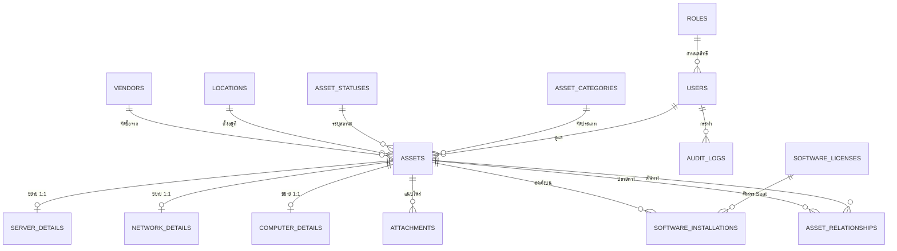
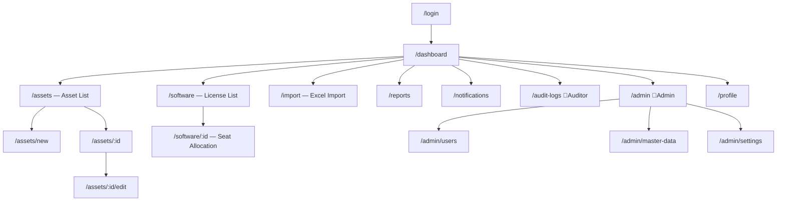

# Project Requirement Document (PRD)
## KKND — IT Inventory Management System

| หัวข้อ | รายละเอียด |
|---|---|
| **ชื่อโปรเจกต์** | KKND — IT Inventory Management System |
| **เวอร์ชันเอกสาร** | 1.0 (Draft — รออนุมัติ) |
| **วันที่จัดทำ** | 2026-09-16 |
| **ประเภทระบบ** | Internal Web Application (IT Asset Management + CMDB) |
| **สถานะ** | ⏳ รอการตรวจสอบและอนุมัติจากเจ้าของโปรเจกต์ |

---

## 1. บทสรุปผู้บริหาร (Executive Summary)

ปัจจุบันองค์กรบริหารจัดการทรัพย์สิน IT มากกว่า **2,000 รายการ** ด้วยไฟล์ Excel / Google Sheets
ซึ่งก่อให้เกิดปัญหา 4 ประการ ได้แก่ ข้อมูลไม่เป็นปัจจุบัน (Data Staleness), ไม่มีแหล่งข้อมูลอ้างอิงเดียว
(No Single Source of Truth), ไม่สามารถติดตามวันหมดอายุของ License/Warranty ได้ล่วงหน้า และ
ไม่มีร่องรอยการเปลี่ยนแปลงข้อมูลสำหรับการตรวจสอบ (Audit Trail)

โครงการนี้จะพัฒนา Web Application สำหรับบริหารทรัพย์สิน IT แบบรวมศูนย์ ครอบคลุม 6 ประเภทอุปกรณ์
พร้อมระบบแจ้งเตือนวันหมดอายุอัตโนมัติ ระบบนับสิทธิ์การใช้งาน Software License และระบบบันทึก
ประวัติการเปลี่ยนแปลงแบบ Append-Only เพื่อรองรับการตรวจสอบภายในและมาตรฐาน ISO 27001

---

## 2. วัตถุประสงค์และเป้าหมาย (Objectives & Goals)

### 2.1 วัตถุประสงค์ทางธุรกิจ (Business Objectives)

| # | วัตถุประสงค์ | คำอธิบาย |
|---|---|---|
| **BO-1** | **Asset Tracking** | ทราบว่าองค์กรมีอุปกรณ์อะไร จำนวนเท่าใด ติดตั้งอยู่ที่ใด ใครเป็นผู้ดูแล และมีสถานะอย่างไร |
| **BO-2** | **License & Warranty Management** | ติดตามวันหมดอายุของ Software License และ Warranty/MA พร้อมแจ้งเตือนล่วงหน้าก่อนต่อสัญญา |
| **BO-3** | **CMDB Relationship** | บันทึกความสัมพันธ์ระหว่างอุปกรณ์ เพื่อวิเคราะห์ผลกระทบ (Impact Analysis) เมื่อระบบใดระบบหนึ่งล่ม |
| **BO-4** | **Audit & Compliance** | เก็บบันทึกการเปลี่ยนแปลงข้อมูลทุกครั้งเพื่อรองรับการตรวจสอบภายในและ ISO 27001 |

### 2.2 ตัวชี้วัดความสำเร็จ (Success Metrics)

| ตัวชี้วัด | เป้าหมาย |
|---|---|
| ความครบถ้วนของข้อมูล (Data Completeness) | ≥ 95% ของทรัพย์สินทั้งหมดถูกบันทึกในระบบภายใน 3 เดือน |
| เวลาในการค้นหาข้อมูลอุปกรณ์ 1 รายการ | ≤ 10 วินาที (จากเดิมที่ต้องเปิดหลายไฟล์ Excel) |
| จำนวน License/Warranty ที่หมดอายุโดยไม่รู้ตัว | 0 รายการต่อปี |
| ระยะเวลาเตรียมข้อมูลสำหรับ IT Audit | ลดลง ≥ 70% |

---

## 3. กลุ่มเป้าหมายและผู้ใช้งาน (Target Audience & Personas)

### 3.1 User Personas

| Persona | บทบาท | Pain Point ปัจจุบัน | สิ่งที่ต้องการจากระบบ |
|---|---|---|---|
| 👨‍💼 **สมชาย** — IT Manager | Admin | ไม่เห็นภาพรวมทรัพย์สิน ต้องรอทีมงานรวบรวมข้อมูลเป็นวัน | Dashboard สรุปภาพรวมและรายงานที่พร้อมนำเสนอผู้บริหาร |
| 👩‍💻 **นภา** — IT Support | IT Staff | ต้องแก้ไฟล์ Excel หลายไฟล์ ข้อมูลชนกันบ่อย | ฟอร์มกรอกข้อมูลที่เร็ว ใช้ซ้ำได้ และ Import Excel จำนวนมากได้ |
| 🧑‍🏫 **วิชัย** — Internal Auditor | Auditor | ขอข้อมูลย้อนหลังไม่ได้ ไม่รู้ว่าใครแก้อะไรเมื่อไหร่ | Audit Log ที่ค้นหาได้ และรายงาน License Compliance |
| 🧑‍💼 **มานี** — พนักงานทั่วไป | Viewer | ไม่รู้ว่าเครื่องที่ใช้อยู่หมดประกันเมื่อไหร่ | ค้นหาและดูข้อมูลอุปกรณ์ได้ด้วยตนเอง |

---

## 4. ขอบเขตของโครงการ (Project Scope)

### 4.1 อยู่ในขอบเขต (In Scope — MVP Phase 1)

- ✅ ระบบยืนยันตัวตนและจัดการสิทธิ์ผู้ใช้ 4 ระดับ (RBAC)
- ✅ ระบบจัดการทรัพย์สิน IT 6 ประเภท (CRUD + Soft Delete)
- ✅ ระบบจัดการ Software License พร้อมนับสิทธิ์การใช้งาน (Seat Counting)
- ✅ ระบบบันทึกความสัมพันธ์ระหว่างอุปกรณ์ (CMDB Relationship)
- ✅ Dashboard สรุปภาพรวมพร้อมกราฟ
- ✅ ระบบค้นหาขั้นสูงและกรองข้อมูลหลายเงื่อนไข
- ✅ ระบบ Import / Export ไฟล์ Excel และ CSV
- ✅ ระบบแนบไฟล์เอกสารประกอบ (Attachment)
- ✅ ระบบแจ้งเตือนวันหมดอายุผ่าน Email (SMTP) และ In-app Notification
- ✅ ระบบบันทึกประวัติการใช้งาน (Audit Log แบบ Append-Only)
- ✅ ระบบจัดการข้อมูลพื้นฐาน (Master Data: สถานที่, แผนก, ผู้ขาย, ยี่ห้อ)
- ✅ รองรับ Light Mode และ Dark Mode

### 4.2 ไม่อยู่ในขอบเขต (Out of Scope — เลื่อนไป Phase 2)

| รายการ | เหตุผล |
|---|---|
| ❌ Auto-Discovery (SNMP / WMI / Agent) | ซับซ้อนสูง ต้องเข้าถึงเครือข่ายภายใน ควรทำหลังข้อมูลพื้นฐานนิ่งแล้ว |
| ❌ External API Integration (vCenter, AD, HR, ระบบจัดซื้อ) | ต้องประสานงานหลายฝ่าย ไม่ใช่ความต้องการเร่งด่วน |
| ❌ QR Code / Barcode Scanner | เป็น Enhancement ไม่ใช่ Core Function |
| ❌ Approval Workflow | องค์กรยอมรับการแก้ไขโดยตรงพร้อมบันทึก Audit Log |
| ❌ Row-Level Security แยกตามสาขา/แผนก | ผู้ใช้ทุกคนเห็นข้อมูลทั้งหมด แยกสิทธิ์ตาม Role เท่านั้น |
| ❌ ระบบยืม-คืนอุปกรณ์ (Check-in / Check-out) | ไม่ได้ระบุเป็นความต้องการใน MVP |
| ❌ Single Sign-On (AD / Entra ID) | ใช้ Local Authentication ก่อน แต่จะออกแบบตารางให้รองรับในอนาคต |

---

## 5. ประเภทผู้ใช้งานและสิทธิ์ (User Roles & Permissions)

### 5.1 Authorization Model

**รูปแบบ:** RBAC (Role-Based Access Control) — 4 Roles, **Global Data Scope**
(ผู้ใช้ทุกคนมองเห็นข้อมูลทั้งองค์กร แตกต่างกันที่สิทธิ์การกระทำเท่านั้น)

### 5.2 Permission Matrix

| Action | 🔴 Admin | 🟠 IT Staff | 🔵 Auditor | 🟢 Viewer |
|---|:---:|:---:|:---:|:---:|
| เข้าสู่ระบบ / ดู Dashboard | ✅ | ✅ | ✅ | ✅ |
| ดูรายการทรัพย์สิน / ค้นหา / กรองข้อมูล | ✅ | ✅ | ✅ | ✅ |
| ดูรายละเอียดทรัพย์สิน + ไฟล์แนบ | ✅ | ✅ | ✅ | ✅ |
| Export ข้อมูลเป็น Excel / CSV | ✅ | ✅ | ✅ | ✅ |
| เพิ่มทรัพย์สินใหม่ | ✅ | ✅ | ❌ | ❌ |
| แก้ไขทรัพย์สิน | ✅ | ✅ | ❌ | ❌ |
| ลบทรัพย์สิน (Soft Delete) | ✅ | ✅ | ❌ | ❌ |
| กู้คืนทรัพย์สินที่ลบแล้ว | ✅ | ❌ | ❌ | ❌ |
| อัปโหลด / ลบไฟล์แนบ | ✅ | ✅ | ❌ | ❌ |
| Import ข้อมูลจาก Excel | ✅ | ✅ | ❌ | ❌ |
| จัดการ Software License และ Seat | ✅ | ✅ | ❌ | ❌ |
| ดู **Audit Log** ทั้งระบบ | ✅ | ⚠️ เฉพาะรายการที่ตนเองแก้ไข | ✅ | ❌ |
| ดูรายงาน Compliance | ✅ | ✅ | ✅ | ❌ |
| จัดการผู้ใช้งาน (สร้าง / แก้ไข / ระงับสิทธิ์) | ✅ | ❌ | ❌ | ❌ |
| จัดการ Master Data | ✅ | ❌ | ❌ | ❌ |
| ตั้งค่าระบบ (SMTP, เกณฑ์แจ้งเตือน) | ✅ | ❌ | ❌ | ❌ |

> **หมายเหตุด้านความปลอดภัย:** Audit Log เป็นตารางแบบ **Append-Only** กล่าวคือระบบอนุญาตเฉพาะ
> คำสั่ง `INSERT` เท่านั้น ไม่มีผู้ใช้ระดับใด — รวมถึง Admin — ที่สามารถแก้ไขหรือลบบันทึกได้ผ่านหน้าเว็บ

---

## 6. ความต้องการเชิงหน้าที่ (Functional Requirements)

> **ระดับความสำคัญ (MoSCoW):** 🔴 Must Have · 🟡 Should Have · 🟢 Could Have

### 6.1 Module: Authentication & User Management

| ID | ความต้องการ | ระดับ |
|---|---|:---:|
| FR-AU-01 | ผู้ใช้เข้าสู่ระบบด้วย Username/Email และ Password | 🔴 |
| FR-AU-02 | รหัสผ่านถูกเข้ารหัสด้วย Argon2id ก่อนจัดเก็บ ห้ามเก็บเป็น Plain Text | 🔴 |
| FR-AU-03 | ระบบจำกัดจำนวนครั้งการ Login ที่ผิดพลาด (Rate Limiting) เพื่อป้องกัน Brute-force | 🔴 |
| FR-AU-04 | ระบบล็อกบัญชีชั่วคราวเมื่อกรอกรหัสผ่านผิดเกินจำนวนที่กำหนด | 🟡 |
| FR-AU-05 | ผู้ใช้เปลี่ยนรหัสผ่านของตนเองได้ และ Admin รีเซ็ตรหัสผ่านให้ผู้ใช้อื่นได้ | 🔴 |
| FR-AU-06 | ระบบบังคับนโยบายรหัสผ่านขั้นต่ำ (ความยาว ≥ 8 ตัวอักษร ผสมตัวอักษรและตัวเลข) | 🔴 |
| FR-AU-07 | Session หมดอายุอัตโนมัติเมื่อไม่มีการใช้งาน และมีปุ่ม Logout | 🔴 |
| FR-AU-08 | Admin สร้าง แก้ไข กำหนด Role และระงับสิทธิ์ (Deactivate) ผู้ใช้ได้ | 🔴 |
| FR-AU-09 | ระบบระงับสิทธิ์ผู้ใช้ด้วยการปิดการใช้งาน ไม่ลบข้อมูลออกจากฐานข้อมูล เพื่อรักษาความสมบูรณ์ของ Audit Log | 🔴 |

### 6.2 Module: Asset Management (แกนกลางของระบบ)

| ID | ความต้องการ | ระดับ |
|---|---|:---:|
| FR-AS-01 | ระบบรองรับทรัพย์สิน 6 ประเภท: Server, Network Device, Software License, Computer (PC/Notebook), Storage & Power, Peripheral | 🔴 |
| FR-AS-02 | ทรัพย์สินทุกรายการมีรหัสอ้างอิงเฉพาะ (Asset Tag) ที่ไม่ซ้ำกันทั้งระบบ | 🔴 |
| FR-AS-03 | ระบบตรวจสอบและป้องกันการบันทึก Serial Number ซ้ำ | 🔴 |
| FR-AS-04 | บันทึกข้อมูลร่วมของทุกประเภท: ยี่ห้อ, รุ่น, Serial No., สถานที่, สถานะ, ผู้ดูแล, วันที่ซื้อ, ราคา, ผู้ขาย, วันหมดประกัน | 🔴 |
| FR-AS-05 | บันทึกข้อมูลเฉพาะทางของ Server: Hostname, IP Address, ประเภท (Physical/Virtual), CPU, RAM, Disk, OS | 🔴 |
| FR-AS-06 | บันทึกข้อมูลเฉพาะทางของ Network Device: ประเภท (Switch/Router/Firewall/AP), Management IP, MAC Address, จำนวนพอร์ต, Firmware Version | 🔴 |
| FR-AS-07 | บันทึกข้อมูลเฉพาะทางของ Computer: ผู้ถือครอง (พนักงาน), แผนก, Hostname, OS | 🔴 |
| FR-AS-08 | ทรัพย์สินประเภทอื่นรองรับการเพิ่มคุณสมบัติแบบยืดหยุ่น (Custom Attributes) โดยไม่ต้องแก้โครงสร้างฐานข้อมูล | 🟡 |
| FR-AS-09 | สถานะทรัพย์สินมี 5 ค่า: In Use, In Stock, Under Repair, Retired, Disposed | 🔴 |
| FR-AS-10 | การลบทรัพย์สินเป็นแบบ Soft Delete เท่านั้น ข้อมูลยังคงอยู่ในฐานข้อมูลเพื่อการตรวจสอบ | 🔴 |
| FR-AS-11 | หน้ารายละเอียดทรัพย์สินแสดงประวัติการเปลี่ยนแปลงของรายการนั้นๆ | 🟡 |
| FR-AS-12 | ระบบรองรับการแก้ไขสถานะทรัพย์สินหลายรายการพร้อมกัน (Bulk Update) | 🟢 |

### 6.3 Module: Software License Management

| ID | ความต้องการ | ระดับ |
|---|---|:---:|
| FR-SW-01 | บันทึกข้อมูล Software: ชื่อ, ผู้ผลิต, เวอร์ชัน, ประเภท License, License Key, จำนวน Seat ที่ซื้อ, วันเริ่ม, วันหมดอายุ | 🔴 |
| FR-SW-02 | ผูก Software เข้ากับอุปกรณ์ที่ติดตั้งจริงได้หลายเครื่อง (ความสัมพันธ์ M:N) | 🔴 |
| FR-SW-03 | ระบบคำนวณ **Seat คงเหลือ = จำนวนที่ซื้อ − จำนวนที่ติดตั้งจริง** แบบอัตโนมัติ | 🔴 |
| FR-SW-04 | ระบบแจ้งเตือนเมื่อจำนวนการติดตั้งเกินสิทธิ์ที่ซื้อไว้ (Over-deployment) | 🔴 |
| FR-SW-05 | ระบบป้องกันการบันทึกการติดตั้งซ้ำของ Software เดียวกันบนอุปกรณ์เครื่องเดียวกัน | 🔴 |
| FR-SW-06 | License Key ต้องถูกเข้ารหัสขณะจัดเก็บ และแสดงผลเฉพาะ Admin กับ IT Staff | 🟡 |
| FR-SW-07 | มีรายงาน License Compliance แสดงรายการที่ใช้เกินสิทธิ์และที่ซื้อเกินความจำเป็น | 🟡 |

### 6.4 Module: CMDB Relationship

| ID | ความต้องการ | ระดับ |
|---|---|:---:|
| FR-CM-01 | ผูกความสัมพันธ์ระหว่างทรัพย์สิน 2 รายการได้ เช่น `Hosted On`, `Connected To`, `Depends On`, `Backed Up By` | 🔴 |
| FR-CM-02 | หน้ารายละเอียดทรัพย์สินแสดงรายการอุปกรณ์ที่เกี่ยวข้องทั้งขาเข้าและขาออก | 🔴 |
| FR-CM-03 | ระบบเตือนก่อนเปลี่ยนสถานะเป็น Retired/Disposed หากยังมีอุปกรณ์อื่นพึ่งพาอยู่ | 🟡 |
| FR-CM-04 | แสดงผังความสัมพันธ์แบบภาพ (Relationship Graph) | 🟢 |

### 6.5 Module: Dashboard & Reporting

| ID | ความต้องการ | ระดับ |
|---|---|:---:|
| FR-DB-01 | Dashboard แสดงการ์ดสรุป: จำนวนทรัพย์สินรวม, แยกตามประเภท, แยกตามสถานะ | 🔴 |
| FR-DB-02 | กราฟแท่ง/วงกลมแสดงสัดส่วนทรัพย์สินตามประเภทและตามสถานที่ | 🔴 |
| FR-DB-03 | การ์ดแจ้งเตือน "ใกล้หมดอายุภายใน 30/60/90 วัน" พร้อมลิงก์ไปยังรายการ | 🔴 |
| FR-DB-04 | การ์ดแจ้งเตือนสถานะ License Compliance (ใช้เกินสิทธิ์) | 🟡 |
| FR-DB-05 | รายงานสำเร็จรูป: ทรัพย์สินใกล้หมดประกัน, License Compliance, ทรัพย์สินตามสถานะ, มูลค่าทรัพย์สินรวม | 🟡 |
| FR-DB-06 | ทุกรายงาน Export เป็น Excel ได้ | 🔴 |

### 6.6 Module: Search & Filter

| ID | ความต้องการ | ระดับ |
|---|---|:---:|
| FR-SE-01 | ค้นหาแบบ Global Search จาก Asset Tag, Serial No., Hostname, IP Address, ชื่ออุปกรณ์ | 🔴 |
| FR-SE-02 | กรองข้อมูลหลายเงื่อนไขพร้อมกัน: ประเภท, สถานะ, สถานที่, ผู้ขาย, ช่วงวันหมดอายุ, ผู้ดูแล | 🔴 |
| FR-SE-03 | ตารางข้อมูลใช้ **Server-side Pagination และ Sorting** รองรับข้อมูลเกิน 2,000 รายการโดยไม่ช้า | 🔴 |
| FR-SE-04 | ผู้ใช้เลือกคอลัมน์ที่ต้องการแสดงในตารางได้ | 🟢 |
| FR-SE-05 | Export ผลลัพธ์ตามเงื่อนไขที่กรองไว้เป็น Excel/CSV | 🔴 |

### 6.7 Module: Import / Export

| ID | ความต้องการ | ระดับ |
|---|---|:---:|
| FR-IM-01 | ดาวน์โหลด Template Excel สำหรับแต่ละประเภททรัพย์สิน | 🔴 |
| FR-IM-02 | อัปโหลดไฟล์ Excel/CSV เพื่อนำเข้าข้อมูลจำนวนมาก | 🔴 |
| FR-IM-03 | ระบบตรวจสอบความถูกต้องของข้อมูล (Validation) และ**แสดงผลตัวอย่างพร้อมรายการข้อผิดพลาดก่อนยืนยันบันทึก** | 🔴 |
| FR-IM-04 | การนำเข้าเป็นแบบ Transaction — หากมีข้อผิดพลาดร้ายแรง ต้องไม่บันทึกข้อมูลบางส่วนค้างไว้ | 🔴 |
| FR-IM-05 | รายงานผลการนำเข้า: สำเร็จกี่รายการ ล้มเหลวกี่รายการ พร้อมระบุแถวที่ผิดพลาด | 🔴 |

### 6.8 Module: Attachment

| ID | ความต้องการ | ระดับ |
|---|---|:---:|
| FR-AT-01 | แนบไฟล์เอกสารกับทรัพย์สินได้หลายไฟล์ (ใบกำกับภาษี, PO, สัญญา MA, รูปถ่าย) | 🔴 |
| FR-AT-02 | จำกัดชนิดไฟล์ (PDF, JPG, PNG, XLSX, DOCX) และขนาดไฟล์สูงสุดต่อไฟล์ | 🔴 |
| FR-AT-03 | ตรวจสอบชนิดไฟล์จริงจาก Content (Magic Number) ไม่เชื่อถือนามสกุลไฟล์เพียงอย่างเดียว | 🔴 |
| FR-AT-04 | ไฟล์ถูกจัดเก็บนอก Web Root และเข้าถึงผ่าน API ที่ตรวจสอบสิทธิ์ก่อนเสมอ | 🔴 |
| FR-AT-05 | แสดงรายการไฟล์แนบพร้อมชื่อผู้อัปโหลดและวันที่ | 🟡 |

### 6.9 Module: Notification

| ID | ความต้องการ | ระดับ |
|---|---|:---:|
| FR-NT-01 | ระบบมี **Scheduled Job** ทำงานวันละ 1 ครั้ง เพื่อสแกนรายการที่ใกล้หมดอายุ | 🔴 |
| FR-NT-02 | แจ้งเตือนล่วงหน้า 90, 60, 30 และ 7 วัน ก่อนวันหมดอายุ (ปรับค่าได้โดย Admin) | 🔴 |
| FR-NT-03 | ส่งอีเมลแจ้งเตือนผ่าน SMTP ขององค์กรไปยัง Admin และผู้ดูแลทรัพย์สินนั้น | 🔴 |
| FR-NT-04 | แสดงกระดิ่งแจ้งเตือนในระบบ (In-app Notification) พร้อมสถานะอ่าน/ยังไม่อ่าน | 🔴 |
| FR-NT-05 | ระบบป้องกันการส่งอีเมลซ้ำสำหรับรายการเดิมในรอบเดียวกัน | 🔴 |
| FR-NT-06 | Admin ทดสอบการเชื่อมต่อ SMTP ได้จากหน้าตั้งค่า | 🟡 |

### 6.10 Module: Audit Log

| ID | ความต้องการ | ระดับ |
|---|---|:---:|
| FR-AD-01 | บันทึกทุกการกระทำที่เปลี่ยนแปลงข้อมูล (Create, Update, Delete, Import, Login, Logout, Failed Login) | 🔴 |
| FR-AD-02 | แต่ละบันทึกเก็บ: ผู้กระทำ, การกระทำ, ตารางและรหัสข้อมูลที่ถูกกระทำ, ค่าก่อนเปลี่ยน, ค่าหลังเปลี่ยน, วันเวลา, IP Address | 🔴 |
| FR-AD-03 | ตาราง Audit Log เป็นแบบ **Append-Only** ไม่มีช่องทางแก้ไขหรือลบผ่านหน้าเว็บ | 🔴 |
| FR-AD-04 | ค้นหาและกรอง Audit Log ตามผู้ใช้, ช่วงวันที่, ประเภทการกระทำ และรายการทรัพย์สิน | 🔴 |
| FR-AD-05 | Export Audit Log เป็น Excel สำหรับส่งผู้ตรวจสอบ | 🟡 |

### 6.11 Module: Master Data

| ID | ความต้องการ | ระดับ |
|---|---|:---:|
| FR-MD-01 | Admin จัดการข้อมูลพื้นฐานได้: สถานที่/สาขา, แผนก, ผู้ขาย (Vendor), ยี่ห้อ (Manufacturer), ประเภททรัพย์สิน | 🔴 |
| FR-MD-02 | ระบบป้องกันการลบ Master Data ที่ยังถูกอ้างอิงโดยทรัพย์สินอยู่ | 🔴 |
| FR-MD-03 | รองรับโครงสร้างสถานที่แบบลำดับชั้น (สาขา → อาคาร → ห้อง/Rack) | 🟡 |

---

## 7. ความต้องการที่ไม่ใช่เชิงหน้าที่ (Non-Functional Requirements)

| ID | ประเภท | ความต้องการ |
|---|---|---|
| NFR-01 | **Performance** | หน้ารายการทรัพย์สิน 2,000+ รายการต้องโหลดเสร็จภายใน 2 วินาที ด้วย Server-side Pagination |
| NFR-02 | **Performance** | ต้องสร้าง Index บนคอลัมน์ที่ใช้ค้นหาบ่อย: Asset Tag, Serial No., IP Address, Hostname, วันหมดอายุ, สถานะ |
| NFR-03 | **Scalability** | โครงสร้างต้องรองรับการเติบโตถึง 10,000 รายการโดยไม่ต้องออกแบบใหม่ |
| NFR-04 | **Security** | ป้องกัน SQL Injection ด้วย Parameterized Query / ORM เท่านั้น ห้ามต่อสตริง SQL |
| NFR-05 | **Security** | ป้องกัน XSS ด้วยการ Escape Output และกำหนด Content Security Policy |
| NFR-06 | **Security** | ตรวจสอบสิทธิ์ที่ฝั่ง Server ทุก Endpoint ห้ามพึ่งพาการซ่อนปุ่มฝั่ง Client เพียงอย่างเดียว |
| NFR-07 | **Security** | ข้อมูลอ่อนไหว (Password, License Key) ต้องเข้ารหัส และไม่ปรากฏใน Log |
| NFR-08 | **Usability** | รองรับ Light Mode และ Dark Mode สลับได้ และจดจำค่าที่ผู้ใช้เลือกไว้ |
| NFR-09 | **Usability** | Desktop-first Responsive — ใช้งานเต็มรูปแบบบน Desktop และดูข้อมูล/Dashboard ได้บนมือถือ |
| NFR-10 | **Usability** | ภาษาในหน้าเว็บทั้งหมดเป็น **ภาษาอังกฤษ** |
| NFR-11 | **Compatibility** | รองรับเบราว์เซอร์รุ่นล่าสุด: Chrome, Edge, Firefox, Safari |
| NFR-12 | **Availability** | ระบบต้องพร้อมใช้งานในเวลาทำการ พร้อมแผนสำรองข้อมูลรายวัน |
| NFR-13 | **Maintainability** | โค้ดใช้ TypeScript ทั้งระบบ พร้อม Lint และ Format Rule ที่บังคับใช้ |
| NFR-14 | **Deployment** | ติดตั้งแบบ On-Premise ภายในองค์กร ใช้ฐานข้อมูล Microsoft SQL Server |

---

## 8. โครงสร้างข้อมูลเบื้องต้น (Preliminary Data Model)

> 📌 รายละเอียดฉบับเต็ม (Data Types, PK, FK, Index, SQL Script) จะจัดทำใน **Phase 3: Database Architecture**

### 8.1 แนวทางการออกแบบ: Class Table Inheritance

เนื่องจากระบบรองรับทรัพย์สิน 6 ประเภทที่มีคุณสมบัติร่วมกันจำนวนมาก แต่มีคุณสมบัติเฉพาะทางต่างกัน
จึงเลือกใช้รูปแบบ **ตารางแกนกลาง + ตารางขยายเฉพาะทาง** แทนการสร้างตารางแยกอิสระ 6 ตาราง

**ข้อดี:** เพิ่มประเภททรัพย์สินใหม่ได้โดยไม่ต้องแก้โครงสร้างเดิม, ค้นหาข้ามประเภทได้ในคำสั่งเดียว,
ลดการซ้ำซ้อนของคอลัมน์ (Normalization)

### 8.2 รายการ Entity หลัก

| กลุ่ม | Entity | คำอธิบาย |
|---|---|---|
| **Identity** | `users` | ผู้ใช้งานระบบ (รองรับ `external_id` สำหรับ SSO ในอนาคต) |
| | `roles` | บทบาท 4 ระดับ |
| | `refresh_tokens` | จัดการ Session |
| **Core Asset** | `assets` | ⭐ ตารางแกนกลางของทรัพย์สินทุกประเภท |
| | `asset_categories` | ประเภททรัพย์สิน 6 หมวด |
| | `asset_statuses` | สถานะ 5 ค่า |
| **Asset Detail** | `server_details` | ข้อมูลเฉพาะ Server (1:1 กับ `assets`) |
| | `network_details` | ข้อมูลเฉพาะ Network Device (1:1) |
| | `computer_details` | ข้อมูลเฉพาะ PC/Notebook (1:1) |
| **Software** | `software_licenses` | ข้อมูล License และจำนวน Seat ที่ซื้อ |
| | `software_installations` | 🔗 ตารางกลาง M:N ระหว่าง Software ↔ Asset (ใช้นับ Seat) |
| **CMDB** | `asset_relationships` | 🔗 ความสัมพันธ์ระหว่างทรัพย์สิน (Self-Referencing M:N) |
| **Master Data** | `locations` | สถานที่/สาขา (รองรับลำดับชั้น) |
| | `departments` | แผนก |
| | `vendors` | ผู้ขาย/ผู้ให้บริการ |
| | `manufacturers` | ยี่ห้อ |
| **Support** | `attachments` | ไฟล์แนบ |
| | `audit_logs` | 🔒 บันทึกการเปลี่ยนแปลง (Append-Only) |
| | `notifications` | การแจ้งเตือนในระบบ |
| | `notification_history` | ประวัติการส่งอีเมล (ป้องกันส่งซ้ำ) |
| | `system_settings` | ค่าตั้งค่าระบบ (SMTP, เกณฑ์แจ้งเตือน) |

### 8.3 ความสัมพันธ์หลัก (High-Level ERD)

---

## 9. โครงสร้างหน้าเว็บ (Sitemap)

### 9.1 รายละเอียดหน้าหลัก

| หน้า | สิทธิ์เข้าถึง | องค์ประกอบสำคัญ |
|---|---|---|
| **Login** | ทุกคน | ฟอร์มเข้าสู่ระบบ, ข้อความแจ้งข้อผิดพลาด, ปุ่มสลับ Dark Mode |
| **Dashboard** | ทุก Role | การ์ดสรุป 4 ใบ, กราฟ 2 ชุด, ตารางรายการใกล้หมดอายุ, แถบสถานะ License |
| **Asset List** | ทุก Role | แถบค้นหา, แผงตัวกรอง, แท็บแยกประเภท, ตารางพร้อม Pagination, ปุ่ม Export/Import |
| **Asset Detail** | ทุก Role | ข้อมูลทั่วไป, ข้อมูลเฉพาะทาง, แท็บไฟล์แนบ, แท็บ Software ที่ติดตั้ง, แท็บอุปกรณ์ที่เกี่ยวข้อง, แท็บประวัติการแก้ไข |
| **Asset Form** | Admin, IT Staff | ฟอร์มแบ่งส่วน, ฟิลด์เฉพาะทางเปลี่ยนตามประเภทที่เลือก, ตรวจสอบข้อมูลทันที |
| **Software Detail** | ทุก Role | ข้อมูล License, แถบแสดง Seat (ซื้อ/ใช้/เหลือ), ตารางเครื่องที่ติดตั้ง, ปุ่มเพิ่ม-ถอนการติดตั้ง |
| **Import** | Admin, IT Staff | ดาวน์โหลด Template, อัปโหลดไฟล์, ตารางตัวอย่างพร้อมไฮไลต์ข้อผิดพลาด, ปุ่มยืนยัน |
| **Audit Logs** | Admin, Auditor | ตัวกรองหลายเงื่อนไข, ตารางบันทึก, หน้าต่างเปรียบเทียบค่าก่อน-หลัง |
| **Admin** | Admin | จัดการผู้ใช้, Master Data, ตั้งค่า SMTP และเกณฑ์แจ้งเตือน |

---

## 10. แนวทางการออกแบบ (Design Direction)

| หัวข้อ | แนวทาง |
|---|---|
| **Theme** | รองรับทั้ง Light และ Dark Mode ผ่าน CSS Variable (Design Token) จดจำค่าที่ผู้ใช้เลือก |
| **Layout** | Sidebar ด้านซ้าย (ยุบได้) + Top Bar (ค้นหา, กระดิ่งแจ้งเตือน, สลับธีม, เมนูผู้ใช้) + Content Area |
| **Typography** | ฟอนต์ Sans-serif ที่อ่านตัวเลขและตัวอักษรคล้ายกันได้ชัดเจน (สำคัญมากสำหรับ Serial No. และ IP Address) |
| **Semantic Color** | 🟢 In Use · 🔵 In Stock · 🟡 Under Repair · ⚫ Retired · 🔴 Disposed / หมดอายุ |
| **Spacing** | ใช้สเกล 4px เป็นหน่วยฐาน เพื่อความสม่ำเสมอทั้งระบบ |
| **Accessibility** | ค่าความต่างของสี (Contrast Ratio) ผ่านเกณฑ์ WCAG AA ทั้งสองธีม, ไม่สื่อความหมายด้วยสีเพียงอย่างเดียว |

---

## 11. เทคโนโลยีที่เสนอ (Proposed Tech Stack)

| ชั้น | เทคโนโลยี | เหตุผล |
|---|---|---|
| **Frontend** | Next.js (App Router) + TypeScript | Full-stack ในโปรเจกต์เดียว ลดความซับซ้อนในการติดตั้ง On-Premise |
| **UI** | Tailwind CSS + shadcn/ui | รองรับ Dark Mode ด้วย Design Token โดยธรรมชาติ ปรับแต่งได้เต็มที่ ไม่ผูกกับ Vendor |
| **Table & State** | TanStack Table + TanStack Query | รองรับ Server-side Pagination/Sorting ซึ่งจำเป็นสำหรับข้อมูล 2,000+ รายการ |
| **Chart** | Recharts | น้ำหนักเบา ใช้งานร่วมกับ React ได้ดี รองรับการปรับสีตามธีม |
| **Backend** | Next.js Route Handlers (REST) | ติดตั้งเป็น Process เดียว เหมาะกับ On-Premise ที่ต้องการความเรียบง่ายในการดูแล |
| **ORM** | Prisma | รองรับ SQL Server อย่างเป็นทางการ, ป้องกัน SQL Injection โดยค่าเริ่มต้น, จัดการ Migration ได้ดี |
| **Database** | **Microsoft SQL Server** | ตามมาตรฐานที่องค์กรใช้อยู่ |
| **Auth** | Auth.js (Credentials) + Argon2id | มาตรฐานอุตสาหกรรม และขยายไปรองรับ SSO ได้ในอนาคตโดยไม่ต้องรื้อ |
| **Scheduled Job** | Worker Process แยก (node-cron) | แยกงานเบื้องหลังออกจาก Web Process เพื่อไม่ให้กระทบประสิทธิภาพหน้าเว็บ |
| **Excel** | ExcelJS | รองรับทั้งการอ่านและเขียน พร้อมจัดรูปแบบ Template |
| **Email** | Nodemailer | เชื่อมต่อ SMTP ขององค์กรได้โดยตรง |
| **Deployment** | Docker Compose (App + Worker) | ติดตั้งและอัปเดตบนเซิร์ฟเวอร์ภายในได้ง่าย |

> 💬 **หมายเหตุ:** หากทีมมีความถนัดเป็น .NET อยู่แล้ว สามารถเปลี่ยนฝั่ง Backend เป็น **ASP.NET Core Web API + Entity Framework Core** โดยคงฝั่ง Frontend เดิมไว้ได้ แจ้งผมได้ในขั้นตอนอนุมัติครับ

---

## 12. แผนการพัฒนา (Development Roadmap)

| Sprint | ขอบเขตงาน | ผลลัพธ์ที่ส่งมอบ |
|:---:|---|---|
| **0** | Setup โปรเจกต์, Database Schema, Migration, Seed Data | โครงสร้างพร้อมพัฒนา |
| **1** | Authentication, RBAC, จัดการผู้ใช้, Layout + Dark Mode | เข้าสู่ระบบและควบคุมสิทธิ์ได้ |
| **2** | Master Data, Asset CRUD (Server + Network), ค้นหาและกรอง | บันทึกและค้นหาทรัพย์สินหลักได้ |
| **3** | Asset ประเภทที่เหลือ, Attachment, Audit Log | ครบทุกประเภททรัพย์สินพร้อมร่องรอยการตรวจสอบ |
| **4** | Software License, Seat Counting, CMDB Relationship | บริหาร License และความสัมพันธ์ได้ |
| **5** | Dashboard, Reports, Export | เห็นภาพรวมและออกรายงานได้ |
| **6** | Excel Import + Validation, Notification (Email + In-app) | นำเข้าข้อมูลเดิมและแจ้งเตือนอัตโนมัติได้ |
| **7** | ทดสอบ, ปรับประสิทธิภาพ, เอกสารคู่มือ, Deploy | ระบบพร้อมใช้งานจริง |

---

## 13. ข้อสมมติฐานและความเสี่ยง (Assumptions & Risks)

### 13.1 ข้อสมมติฐาน

1. องค์กรมี SQL Server และเซิร์ฟเวอร์สำหรับติดตั้งระบบพร้อมแล้ว
2. องค์กรมี SMTP Server ที่ระบบสามารถเชื่อมต่อเพื่อส่งอีเมลได้
3. ข้อมูลเดิมใน Excel มีรูปแบบที่สามารถจัดระเบียบให้ตรงกับ Template ได้
4. ผู้ใช้ทุกคนเข้าถึงระบบผ่านเครือข่ายภายในองค์กร (ไม่เปิดสู่อินเทอร์เน็ตสาธารณะ)

### 13.2 ความเสี่ยงและแนวทางรับมือ

| ความเสี่ยง | ระดับ | แนวทางรับมือ |
|---|:---:|---|
| ข้อมูลใน Excel เดิมไม่สะอาด ทำให้ Import ล้มเหลว | 🔴 สูง | ทำ Validation ที่เข้มงวดพร้อมหน้า Preview และรายงานข้อผิดพลาดรายแถว |
| ผู้ใช้ไม่อัปเดตข้อมูลหลังระบบใช้งานจริง ทำให้ข้อมูลเก่า | 🔴 สูง | เพิ่มฟิลด์ "ตรวจสอบล่าสุดเมื่อ" และรายงานรายการที่ไม่ถูกแตะต้องนาน |
| ประสิทธิภาพลดลงเมื่อข้อมูลเพิ่มขึ้น | 🟡 กลาง | บังคับใช้ Server-side Pagination และ Index ตั้งแต่ Sprint แรก |
| ขอบเขตงานบานปลาย (Scope Creep) | 🟡 กลาง | ยึดรายการ Out of Scope ในเอกสารนี้อย่างเคร่งครัด สิ่งที่เพิ่มเข้ามาให้ไปอยู่ Phase 2 |
| License Key รั่วไหล | 🟡 กลาง | เข้ารหัสขณะจัดเก็บ จำกัดสิทธิ์การมองเห็น และบันทึกทุกครั้งที่มีการเปิดดู |

---

## 14. ประเด็นที่ยังต้องยืนยัน (Open Questions)

> ⚠️ ประเด็นเหล่านี้ไม่กระทบการอนุมัติ PRD แต่ต้องได้คำตอบก่อนเริ่ม Phase 3 (Database Design)

| # | คำถาม | ผลกระทบ |
|---|---|---|
| Q1 | รูปแบบรหัส Asset Tag ที่ต้องการ (เช่น `SRV-2026-001`) และต้องการให้ระบบสร้างอัตโนมัติหรือกรอกเอง? | โครงสร้างตาราง `assets` และ Business Logic |
| Q2 | ฟิลด์เฉพาะทางที่แต่ละประเภทต้องเก็บ มีอะไรนอกเหนือจากที่ระบุใน FR-AS-05 ถึง FR-AS-07 บ้าง? | โครงสร้างตารางขยาย |
| Q3 | ต้องเก็บ Audit Log ย้อนหลังนานเท่าใด (1 ปี / 3 ปี / ตลอดไป)? | นโยบายการจัดเก็บและขนาดฐานข้อมูล |
| Q4 | ขนาดไฟล์แนบสูงสุดต่อไฟล์ และพื้นที่จัดเก็บที่จัดสรรได้? | การตั้งค่าระบบจัดเก็บไฟล์ |
| Q5 | จำนวนผู้ใช้งานพร้อมกันสูงสุดโดยประมาณ? | การกำหนดสเปกเซิร์ฟเวอร์ |
| Q6 | องค์กรมีแนวทางการสำรองข้อมูล (Backup Policy) อยู่แล้วหรือไม่? | แผนการ Deploy |

---

## 15. การอนุมัติเอกสาร (Sign-off)

กรุณาตรวจสอบและยืนยันรายการต่อไปนี้:

- [ ] วัตถุประสงค์ทางธุรกิจทั้ง 4 ข้อ (ส่วนที่ 2) ถูกต้องครบถ้วน
- [ ] ขอบเขตงาน In Scope และ Out of Scope (ส่วนที่ 4) เป็นที่ยอมรับ
- [ ] Permission Matrix ของ 4 Roles (ส่วนที่ 5) ตรงกับการทำงานจริง
- [ ] Functional Requirements ทั้ง 11 Module (ส่วนที่ 6) ครบถ้วน ไม่มีตกหล่น
- [ ] Sitemap และแนวทางการออกแบบ (ส่วนที่ 9-10) เป็นที่พอใจ
- [ ] Tech Stack ที่เสนอ (ส่วนที่ 11) เหมาะสมกับทีมและองค์กร

**เมื่ออนุมัติแล้ว ขั้นตอนถัดไปคือ:**
1. **Phase 2 — UI/UX Design:** User Flow, Wireframe รายหน้า, Design System ฉบับสมบูรณ์
2. **Phase 3 — Database Architecture:** ER Diagram ฉบับเต็ม + SQL Script สำหรับ SQL Server
3. **Phase 4 — Development:** เริ่มพัฒนาตาม Roadmap ในส่วนที่ 12

---

*เอกสารฉบับนี้จัดทำในขั้นตอน Requirement Gathering — ยังไม่มีการเขียนโค้ดหรือสร้างโครงสร้างโปรเจกต์ใดๆ*
