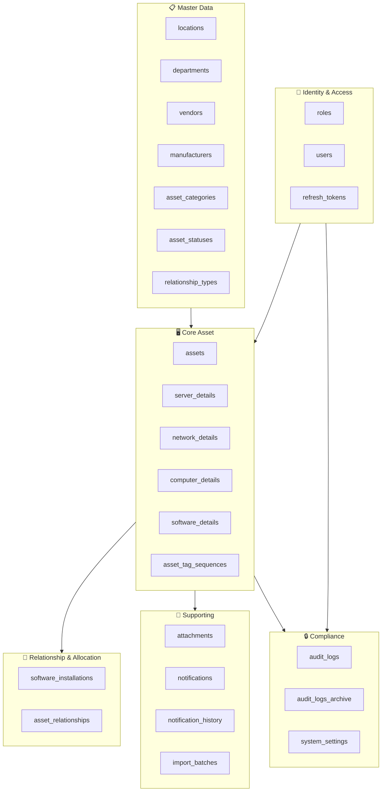
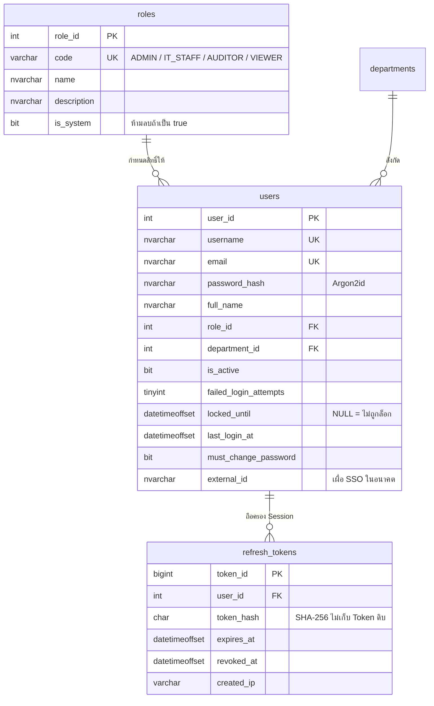
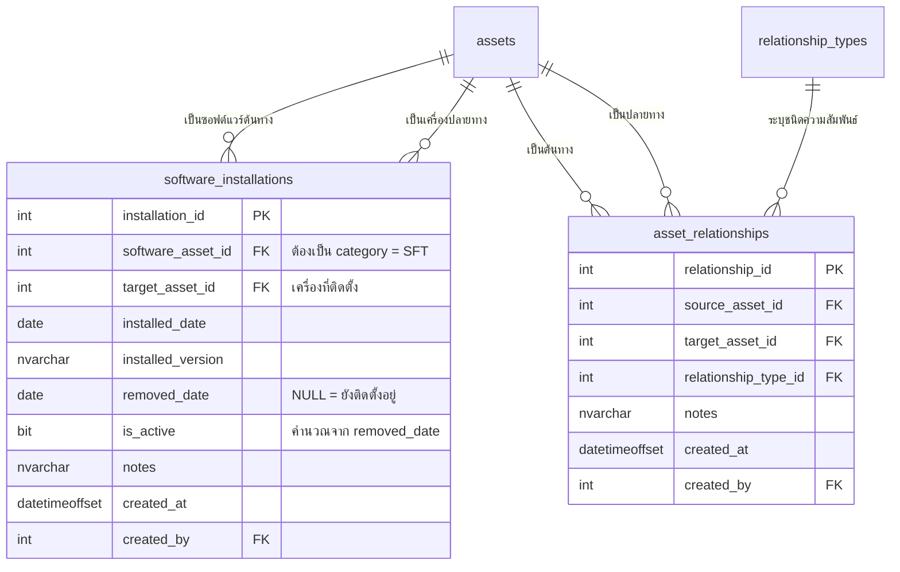
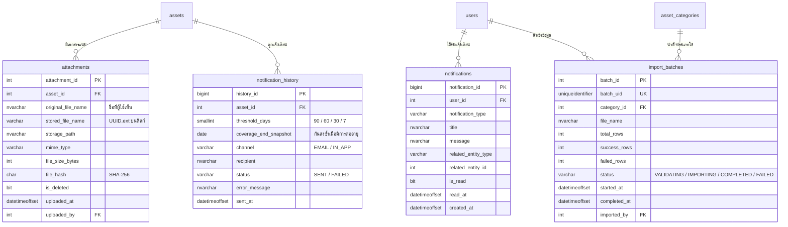
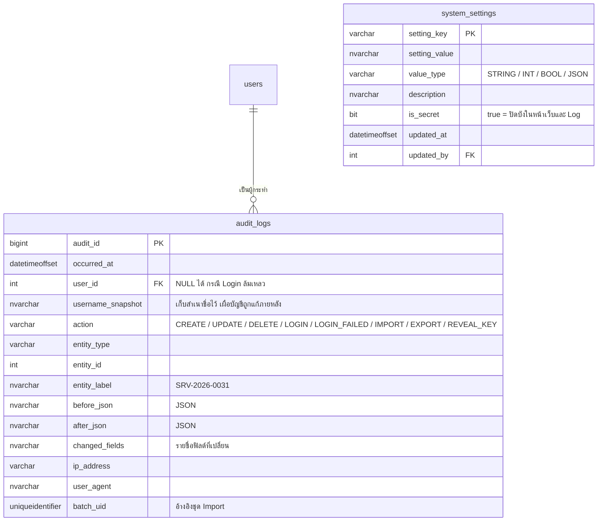

# Phase 3.1 — Database Design & ER Diagram
## KKND — IT Inventory Management System

| หัวข้อ | รายละเอียด |
|---|---|
| **เอกสาร** | Database Design & Entity-Relationship Diagram |
| **เวอร์ชัน** | 1.0 (Draft — รออนุมัติ) |
| **DBMS** | Microsoft SQL Server (2019 ขึ้นไป · ทดสอบกับ 2022/2025) |
| **Collation ที่แนะนำ** | `Thai_100_CI_AS_SC_UTF8` หรือ `SQL_Latin1_General_CP1_CI_AS` + ใช้ `NVARCHAR` ทุกฟิลด์ข้อความ |
| **อ้างอิง** | `docs/PRD.md` · `docs/design/*` |

---

## 1. คำตอบของประเด็นที่ค้างไว้ (Resolved Open Questions)

ผู้ใช้มอบหมายให้ผมกำหนดค่าที่เหมาะสม ต่อไปนี้คือค่าที่เลือกพร้อมเหตุผล
**ทุกค่าปรับเปลี่ยนได้ภายหลังโดยไม่กระทบโครงสร้างตาราง** เว้นแต่ระบุไว้เป็นอย่างอื่น

### Q1 · รูปแบบรหัสทรัพย์สิน (Asset Tag)

**ค่าที่กำหนด:** `[PREFIX]-[YYYY]-[NNNN]` เช่น `SRV-2026-0031` (ตกลงไว้แล้วใน Phase 2.2)

| รายละเอียด | ค่า |
|---|---|
| Prefix | `SRV` `NET` `SFT` `PC` `STG` `PER` (เก็บในตาราง `asset_categories.code`) |
| เลขลำดับ | 4 หลัก แยกนับตามประเภทและปี รีเซ็ตทุกต้นปี |
| การสร้าง | Stored Procedure `sp_generate_asset_tag` ใช้ `UPDLOCK` ป้องกันรหัสซ้ำเมื่อมีผู้ใช้หลายคนบันทึกพร้อมกัน |
| การนำกลับมาใช้ซ้ำ | ❌ ไม่นำกลับมาใช้ แม้รายการถูกลบ |
| กรณี Import | ยอมรับรหัสเดิมจากไฟล์ได้ และระบบจะเลื่อนตัวนับให้สูงกว่าค่าสูงสุดที่นำเข้ามา |

> **เหตุผล:** รหัสที่อ่านแล้วเดาประเภทได้ทันทีช่วยลดข้อผิดพลาดตอนสื่อสารทางโทรศัพท์
> และการไม่นำรหัสกลับมาใช้ซ้ำเป็นข้อกำหนดพื้นฐานของระบบที่ต้องผ่านการตรวจสอบ

### Q2 · ฟิลด์เฉพาะทางของแต่ละประเภท

**ค่าที่กำหนด:** สร้างตารางขยาย 4 ตาราง ครอบคลุมฟิลด์ที่ใช้งานจริงในองค์กรทั่วไป
พร้อมช่อง `custom_attributes` แบบ JSON สำหรับฟิลด์ที่ยังไม่ได้ระบุ

| ประเภท | ตารางขยาย | จำนวนฟิลด์เฉพาะ |
|---|---|:---:|
| Server | `server_details` | 17 |
| Network Device | `network_details` | 13 |
| Computer (PC/Notebook) | `computer_details` | 13 |
| Software License | `software_details` | 11 |
| Storage & Power · Peripheral | ใช้ `assets.custom_attributes` (JSON) | ยืดหยุ่น |

> **เหตุผล:** 4 ประเภทแรกมีฟิลด์ที่ต้องค้นหาและกรองบ่อย (IP, Hostname, Seat) จึงต้องเป็นคอลัมน์จริง
> ที่สร้าง Index ได้ ส่วน Storage และ Peripheral มีฟิลด์เฉพาะไม่กี่ตัวและไม่ใช้ค้นหา จึงใช้ JSON
> ได้โดยไม่เสียประสิทธิภาพ — **หากภายหลังพบว่าต้องค้นหาฟิลด์ใดใน JSON บ่อย สามารถเลื่อนขึ้นมาเป็นคอลัมน์จริงได้**

### Q3 · ระยะเวลาเก็บ Audit Log

**ค่าที่กำหนด:** เก็บออนไลน์ **ไม่จำกัด** · มีตารางและกระบวนการย้ายข้อมูลเก่าเตรียมไว้ให้พร้อมใช้เมื่อจำเป็น

| ประเด็น | ค่า |
|---|---|
| ปริมาณที่ประเมิน | ~2,350 ทรัพย์สิน × แก้ไขเฉลี่ย 10 ครั้ง/ปี + Login ~4,500 ครั้ง/ปี ≈ **30,000 แถว/ปี** |
| ขนาดต่อปีโดยประมาณ | ~45 MB/ปี (รวม JSON ก่อน-หลัง) |
| นโยบายที่แนะนำ | เก็บออนไลน์อย่างน้อย **3 ปี** (ตามรอบตรวจ ISO 27001) แต่ด้วยปริมาณระดับนี้ การเก็บ 7–10 ปีแทบไม่มีต้นทุน |
| การลบ | ❌ **ห้ามลบผ่านแอปพลิเคชันโดยเด็ดขาด** · การย้ายไปตารางเก็บถาวรทำโดย DBA เท่านั้น |
| เครื่องมือที่เตรียมไว้ | ตาราง `audit_logs_archive` + Stored Procedure `sp_archive_audit_logs` |

> **ความเห็นเชิงวิศวกรรม:** ที่ปริมาณ 30,000 แถว/ปี การตั้งนโยบายลบทิ้งเป็นการเพิ่มความเสี่ยง
> โดยไม่ได้ประโยชน์ด้านประสิทธิภาพเลย ควรเริ่มพิจารณาย้ายข้อมูลเมื่อตารางเกิน **5 ล้านแถว**
> ซึ่งตามอัตรานี้คือประมาณ 160 ปีข้างหน้า

### Q4 · ไฟล์แนบ

| ประเด็น | ค่าที่กำหนด | เหตุผล |
|---|---|---|
| ขนาดสูงสุดต่อไฟล์ | **10 MB** | ใบกำกับภาษีและสัญญาที่สแกนแล้วมักอยู่ที่ 1–3 MB · 10 MB รองรับเอกสารหลายสิบหน้าได้สบาย |
| จำนวนไฟล์ต่อทรัพย์สิน | **20 ไฟล์** | เพียงพอต่อ PO + ใบกำกับ + สัญญา + รูปถ่ายหลายมุม |
| ขนาดรวมต่อทรัพย์สิน | **100 MB** | ป้องกันผู้ใช้อัปโหลดวิดีโอหรือไฟล์ Backup |
| ชนิดไฟล์ที่อนุญาต | PDF · JPG · PNG · WEBP · XLSX · DOCX | ครอบคลุมเอกสารและรูปภาพ · **ไม่อนุญาต ZIP และไฟล์ที่ประมวลผลได้** |
| การจัดเก็บ | นอก Web Root · ตั้งชื่อไฟล์ใหม่เป็น UUID · เก็บ SHA-256 ไว้ตรวจความถูกต้อง | ป้องกัน Path Traversal และการเดาชื่อไฟล์ |
| พื้นที่ที่ควรจัดสรร | **100 GB** | ประเมินจาก 2,350 × 2 ไฟล์ × 500 KB ≈ 2.3 GB ในปีแรก · เผื่อเติบโต 10 ปี |

### Q5 · จำนวนผู้ใช้พร้อมกันและสเปกเซิร์ฟเวอร์

| ประเด็น | ค่าที่กำหนด |
|---|---|
| ผู้ใช้ทั้งหมด | ~20 บัญชี |
| ใช้งานพร้อมกันปกติ | 10–15 คน |
| ออกแบบให้รองรับ | **50 คนพร้อมกัน** (เผื่อ 3 เท่า) |
| สเปก App Server | 4 vCPU · 8 GB RAM · 100 GB SSD |
| สเปก Database Server | 4 vCPU · 16 GB RAM · 200 GB SSD |
| Connection Pool | 20 connections (App) + 5 (Worker) |

### Q6 · นโยบายสำรองข้อมูล

| ประเภท | ความถี่ | เก็บไว้ |
|---|---|---|
| Full Backup | ทุกวัน 01:00 น. | 30 วัน |
| Differential Backup | ทุก 6 ชั่วโมง | 7 วัน |
| Transaction Log Backup | ทุก 15 นาที | 7 วัน |
| สำเนานอกสถานที่ | รายสัปดาห์ | 12 สัปดาห์ |
| **RPO** (ข้อมูลที่ยอมให้สูญหาย) | **15 นาที** | |
| **RTO** (เวลากู้คืนที่ยอมรับได้) | **4 ชั่วโมง** | |
| ไฟล์แนบ | สำรองพร้อมฐานข้อมูล (ไฟล์ระบบแยกต่างหาก) | 30 วัน |
| Recovery Model | `FULL` | จำเป็นสำหรับ Log Backup ทุก 15 นาที |

---

## 2. การปรับปรุงจาก PRD §8.2 (สำคัญ — โปรดตรวจสอบ)

ระหว่างออกแบบโครงสร้างจริง ผมพบจุดที่ควรปรับ **2 ข้อ** เพื่อให้ระบบทำงานได้ดีขึ้น
ทั้งสองข้อเปลี่ยนจากที่ระบุไว้ใน PRD จึงขอแจ้งให้ทราบอย่างชัดเจน

### 2.1 ยุบตาราง `software_licenses` เข้าเป็น `software_details`

| | PRD เดิม | ที่ปรับใหม่ |
|---|---|---|
| โครงสร้าง | ตาราง `software_licenses` แยกอิสระ | แถวใน `assets` (category = Software) + ตารางขยาย `software_details` |

**เหตุผล 4 ข้อ**

1. PRD กำหนดให้ Software License เป็น **1 ใน 6 ประเภททรัพย์สิน** และมี Asset Tag ของตัวเอง (`SFT-2026-0007`) — การแยกตารางจึงขัดกับการออกแบบที่ตกลงกันไว้
2. Software License มีฟิลด์ร่วมกับทรัพย์สินอื่นเกือบทั้งหมด: ผู้ขาย · เลขที่ PO · วันที่ซื้อ · ราคา · วันหมดอายุ · ผู้ดูแล · ไฟล์แนบ — การแยกตารางทำให้ต้องเขียนคอลัมน์ซ้ำ 12 ช่อง
3. **หน้าค้นหาและ Dashboard ต้องค้นข้ามประเภทได้** หากแยกตาราง ทุก Query จะกลายเป็น `UNION` ซึ่งใช้ Index ได้ไม่ดีและช้าลงเมื่อข้อมูลโต
4. **งานสแกนวันหมดอายุ (FR-NT-01) กลายเป็น Query เดียว** แทนที่จะต้องสแกน 2 ตารางแล้วรวมผล — ลดความซับซ้อนของ Worker ลงครึ่งหนึ่ง

### 2.2 เปลี่ยนชื่อ `warranty_start/end` เป็น `coverage_start_date/coverage_end_date`

| | ชื่อเดิม | ชื่อใหม่ | ความหมาย |
|---|---|---|---|
| ฮาร์ดแวร์ | `warranty_end` | `coverage_end_date` | วันหมดประกัน / วันหมดสัญญา MA |
| ซอฟต์แวร์ | (อยู่คนละตาราง) | `coverage_end_date` | วันหมด License |

**เหตุผล:** เมื่อรวม Software เข้ามาอยู่ในตาราง `assets` แล้ว คอลัมน์เดียวนี้ต้องรองรับทั้ง
"วันหมดประกัน" และ "วันหมด License" — การใช้ชื่อกลางๆ ทำให้ความหมายตรงกับข้อมูลจริง
และที่สำคัญคือ**สแกนวันหมดอายุทั้งระบบได้ด้วย Index เดียว**

> 🖥️ **หน้าเว็บยังแสดงคำว่า "Warranty End" สำหรับฮาร์ดแวร์ และ "License Expires"
> สำหรับซอฟต์แวร์ตามเดิม** — เปลี่ยนเฉพาะชื่อคอลัมน์ในฐานข้อมูล ผู้ใช้ไม่เห็นความแตกต่าง

---

## 3. หลักการออกแบบฐานข้อมูล (Design Principles)

| # | หลักการ | การนำไปใช้ |
|---|---|---|
| 1 | **Class Table Inheritance** | `assets` เป็นแกนกลาง + ตารางขยาย 1:1 ตามประเภท |
| 2 | **Soft Delete ทุกตารางหลัก** | ใช้ `is_deleted` + `deleted_at` + `deleted_by` ไม่ลบข้อมูลจริง (FR-AS-10) |
| 3 | **Audit Trail ทุกแถว** | ทุกตารางหลักมี `created_at/by` และ `updated_at/by` |
| 4 | **Lookup Table แทน ENUM** | สถานะและประเภทเก็บในตาราง เพื่อให้ Admin เพิ่มได้โดยไม่ต้อง Deploy ใหม่ |
| 5 | **NVARCHAR ทุกฟิลด์ข้อความ** | แม้หน้าเว็บเป็นภาษาอังกฤษ แต่ช่อง Notes และชื่อผู้ใช้อาจมีภาษาไทย |
| 6 | **DATETIMEOFFSET สำหรับ Timestamp** | เก็บ Time Zone ไว้ด้วย จำเป็นมากสำหรับหลักฐานการตรวจสอบ |
| 7 | **ไม่ใช้ CASCADE DELETE** | ทุก Foreign Key เป็น `NO ACTION` เพื่อบังคับ FR-MD-02 (ห้ามลบข้อมูลที่ถูกอ้างอิง) |
| 8 | **คำนวณค่าผ่าน View ไม่เก็บค่าซ้ำ** | จำนวน Seat คงเหลือคำนวณสดเสมอ ป้องกันข้อมูลไม่ตรงกัน |

---

## 4. ภาพรวมโครงสร้าง (High-Level Domain Map)



**รวมทั้งสิ้น 25 ตาราง · 5 View · 3 Stored Procedure · 1 Trigger**

---

## 5. ER Diagram แยกตามโดเมน

### 5.1 โดเมนที่ 1 — Identity & Access



> **หมายเหตุด้านความปลอดภัย:** ตาราง `refresh_tokens` เก็บเฉพาะ **ค่า Hash ของ Token**
> ไม่ใช่ Token ดิบ — หากฐานข้อมูลรั่วไหล ผู้โจมตีจะนำ Token ไปใช้ต่อไม่ได้

### 5.2 โดเมนที่ 2 — Master Data

```mermaid
erDiagram
    locations ||--o{ locations : "มีลำดับชั้นย่อย"

    locations {
        int location_id PK
        int parent_location_id FK "NULL = ระดับบนสุด"
        varchar code UK
        nvarchar name
        varchar location_type "SITE / BUILDING / FLOOR / ROOM / RACK"
        int sort_order
        bit is_active
    }

    departments {
        int department_id PK
        varchar code UK
        nvarchar name
        bit is_active
    }

    vendors {
        int vendor_id PK
        varchar code UK
        nvarchar name
        nvarchar contact_person
        nvarchar phone
        nvarchar email
        bit is_active
    }

    manufacturers {
        int manufacturer_id PK
        nvarchar name UK
        bit is_active
    }

    asset_categories {
        int category_id PK
        varchar code UK "SRV / NET / SFT / PC / STG / PER"
        nvarchar name
        varchar detail_table "ชื่อตารางขยายที่ผูกอยู่"
        varchar icon_name
        bit is_active
    }

    asset_statuses {
        int status_id PK
        varchar code UK "IN_USE / IN_STOCK / UNDER_REPAIR / RETIRED / DISPOSED"
        nvarchar name
        varchar color_token
        bit is_operational "true = ยังใช้งานอยู่"
        int sort_order
    }

    relationship_types {
        int relationship_type_id PK
        varchar code UK "HOSTED_ON / CONNECTED_TO / DEPENDS_ON / BACKED_UP_BY"
        nvarchar forward_name "Hosted On"
        nvarchar inverse_name "Hosts"
    }
```



> **โครงสร้างสถานที่แบบลำดับชั้น** (FR-MD-03) ใช้ Self-Referencing Foreign Key
> รองรับ Site → Building → Floor → Room → Rack ได้ไม่จำกัดระดับ
> และมี Recursive View `vw_location_tree` สำหรับแสดงเส้นทางเต็ม เช่น `HQ Bangkok / DC1 / Rack A2`

### 5.3 โดเมนที่ 3 — Core Asset (หัวใจของระบบ)

```mermaid
erDiagram
    asset_categories ||--o{ assets : "จัดประเภท"
    asset_statuses   ||--o{ assets : "ระบุสถานะ"
    locations        ||--o{ assets : "ตั้งอยู่ที่"
    departments      ||--o{ assets : "สังกัด"
    vendors          ||--o{ assets : "จัดซื้อจาก"
    manufacturers    ||--o{ assets : "ผลิตโดย"
    users            ||--o{ assets : "ดูแลโดย"

    assets ||--o| server_details   : "ขยาย 1:1"
    assets ||--o| network_details  : "ขยาย 1:1"
    assets ||--o| computer_details : "ขยาย 1:1"
    assets ||--o| software_details : "ขยาย 1:1"

    assets {
        int asset_id PK
        varchar asset_tag UK "SRV-2026-0031"
        int category_id FK
        nvarchar name
        int manufacturer_id FK
        nvarchar model
        nvarchar serial_number "Unique แบบมีเงื่อนไข"
        int status_id FK
        int location_id FK
        int department_id FK
        int owner_user_id FK
        int vendor_id FK
        nvarchar po_number
        date purchase_date
        decimal purchase_price "DECIMAL(18,2)"
        char currency "THB"
        date coverage_start_date "เริ่มประกัน / เริ่ม License"
        date coverage_end_date "หมดประกัน / หมด License"
        nvarchar support_level
        nvarchar notes
        nvarchar custom_attributes "JSON"
        date last_verified_at "ตรวจนับครั้งล่าสุด"
        bit is_deleted
        datetimeoffset created_at
        int created_by FK
        datetimeoffset updated_at
        int updated_by FK
    }

    server_details {
        int asset_id PK_FK
        varchar server_type "PHYSICAL / VIRTUAL"
        nvarchar hostname
        varchar ip_address
        varchar mgmt_ip
        varchar mac_address
        nvarchar cpu_model
        tinyint cpu_socket_count
        smallint cpu_core_count
        int ram_gb
        nvarchar storage_config
        int storage_total_gb
        nvarchar os_name
        nvarchar os_version
        date os_install_date
        date last_patch_date
        int parent_host_asset_id FK "VM อยู่บน Host ตัวไหน"
    }

    network_details {
        int asset_id PK_FK
        varchar device_type "SWITCH / ROUTER / FIREWALL / AP"
        nvarchar hostname
        varchar mgmt_ip
        varchar mac_address
        smallint port_count
        nvarchar port_speed
        bit poe_support
        nvarchar firmware_version
        date firmware_updated_at
        nvarchar vlan_info
        nvarchar stack_info
    }

    computer_details {
        int asset_id PK_FK
        varchar computer_type "DESKTOP / NOTEBOOK / WORKSTATION"
        nvarchar hostname
        varchar ip_address
        varchar mac_address
        nvarchar cpu_model
        int ram_gb
        nvarchar storage_config
        nvarchar os_name
        nvarchar os_version
        date assigned_date
        nvarchar assigned_to_name "กรณีผู้ถือครองไม่มีบัญชีในระบบ"
    }

    software_details {
        int asset_id PK_FK
        nvarchar publisher
        nvarchar version
        nvarchar edition
        varchar license_type "PERPETUAL / SUBSCRIPTION / OEM / VOLUME / CORE_BASED"
        varbinary license_key_encrypted "AES-256-GCM"
        int seats_purchased
        bit is_per_device
        nvarchar support_level
        bit auto_renew
        nvarchar license_portal_url
    }

    asset_tag_sequences {
        int category_id PK_FK
        smallint year PK
        int last_number
    }
```

### 5.4 โดเมนที่ 4 — Relationship & Allocation



**กติกาสำคัญ 3 ข้อของโดเมนนี้**

| # | กติกา | วิธีบังคับ |
|---|---|---|
| 1 | ห้ามติดตั้ง Software เดียวกันบนเครื่องเดียวกันซ้ำ (FR-SW-05) | Unique Index แบบมีเงื่อนไข `(software_asset_id, target_asset_id) WHERE is_active = 1` |
| 2 | ห้ามผูกความสัมพันธ์กับตัวเอง | `CHECK (source_asset_id <> target_asset_id)` |
| 3 | ห้ามผูกความสัมพันธ์คู่เดิมซ้ำชนิดเดิม | Unique Index `(source_asset_id, target_asset_id, relationship_type_id)` |

> **จุดที่ฐานข้อมูลบังคับไม่ได้:** การตรวจว่า `software_asset_id` ต้องเป็นทรัพย์สินประเภท Software จริง
> ต้องทำที่ Application Layer หรือใช้ Trigger เพราะ SQL Server ไม่รองรับ Subquery ใน CHECK Constraint
> — ผมเลือกให้ตรวจที่ Application Layer เพื่อให้ข้อความแจ้งเตือนเป็นมิตรกับผู้ใช้มากกว่า

### 5.5 โดเมนที่ 5 — Supporting



**กลไกป้องกันการส่งอีเมลซ้ำ (FR-NT-05)**

Unique Index บน `(asset_id, threshold_days, coverage_end_snapshot)` ทำให้:

- แจ้งเตือน 90 วันของทรัพย์สินหนึ่งจะส่งได้ **ครั้งเดียว** ต่อวันหมดอายุหนึ่งค่า
- เมื่อผู้ใช้**ต่อสัญญาและแก้วันหมดอายุใหม่** ค่า `coverage_end_snapshot` เปลี่ยน
  ระบบจึงเริ่มนับรอบแจ้งเตือนใหม่ให้อัตโนมัติ — ตรงกับพฤติกรรมที่ผู้ใช้คาดหวังพอดี

### 5.6 โดเมนที่ 6 — Compliance



**การบังคับ Append-Only (FR-AD-03) — ป้องกัน 3 ชั้น**

| ชั้น | กลไก |
|:---:|---|
| 1 | **Trigger** `trg_audit_logs_no_modify` — ดักจับคำสั่ง `UPDATE` และ `DELETE` แล้วโยน Error ทันที |
| 2 | **สิทธิ์ระดับฐานข้อมูล** — บัญชีที่แอปพลิเคชันใช้ได้รับเฉพาะ `INSERT` และ `SELECT` บนตารางนี้ |
| 3 | **Application Layer** — ไม่มี API Endpoint ใดที่แก้ไขหรือลบ Audit Log ได้ |

> เก็บ `username_snapshot` ไว้คู่กับ `user_id` เพราะหากผู้ใช้ถูกเปลี่ยนชื่อหรือถูกระงับสิทธิ์ในภายหลัง
> หลักฐานต้องยังคงแสดงชื่อ ณ เวลาที่เกิดเหตุการณ์ได้ — เป็นข้อกำหนดพื้นฐานของงานตรวจสอบ

---

## 6. View ที่ระบบใช้งาน

| View | หน้าที่ | ใช้ที่หน้าไหน |
|---|---|---|
| `vw_asset_list` | รวมข้อมูล Asset + ชื่อจากทุก Lookup + จำนวนวันคงเหลือ | Asset List · Global Search |
| `vw_software_seat_usage` | คำนวณ ซื้อ / ใช้ไป / คงเหลือ / เกินสิทธิ์ (FR-SW-03) | Software Detail · Dashboard |
| `vw_expiring_assets` | รายการใกล้หมดอายุพร้อมระดับความเร่งด่วน | Dashboard · Worker แจ้งเตือน |
| `vw_asset_relationships_expanded` | แสดงความสัมพันธ์ทั้งขาเข้าและขาออกในมุมมองเดียว | แท็บ Relations |
| `vw_location_tree` | เส้นทางเต็มของสถานที่แบบลำดับชั้น | ตัวกรอง · Master Data |

### 6.1 ตรรกะการนับ Seat (หัวใจของ FR-SW-03)

```
seats_purchased  = software_details.seats_purchased
seats_used       = COUNT(software_installations WHERE is_active = 1)
seats_available  = seats_purchased − seats_used
is_over_deployed = seats_used > seats_purchased
```

> **ทำไมต้องคำนวณสดทุกครั้ง ไม่เก็บค่าไว้:** หากเก็บ `seats_used` เป็นคอลัมน์จริง
> ค่าจะเพี้ยนทันทีที่มีการลบทรัพย์สิน แก้ไขข้อมูลจากหลายที่พร้อมกัน หรือ Import ข้อมูล
> ที่ปริมาณข้อมูลระดับนี้ การ `COUNT` ผ่าน Index ใช้เวลาไม่ถึง 1 มิลลิวินาที
> — **ความถูกต้องสำคัญกว่าการประหยัดเวลาที่ไม่มีใครรู้สึกได้**

---

## 7. กลยุทธ์การทำ Index (ตาม NFR-02)

| ตาราง | Index | เหตุผล |
|---|---|---|
| `assets` | `UX_assets_asset_tag` (Unique) | ค้นด้วย Asset Tag · ใช้ใน URL |
| `assets` | `UX_assets_serial` (Unique แบบมีเงื่อนไข) | ป้องกัน Serial ซ้ำ (FR-AS-03) เฉพาะแถวที่ยังไม่ถูกลบ |
| `assets` | `IX_assets_list_covering` | **Covering Index** ของหน้ารายการ — ตอบ Query ได้โดยไม่ต้องอ่านตารางจริง |
| `assets` | `IX_assets_coverage_end` | งานสแกนวันหมดอายุรายวันและการ์ด Dashboard |
| `assets` | `IX_assets_status`, `IX_assets_location` | ตัวกรองที่ใช้บ่อยที่สุด |
| `server_details` | `IX_server_ip`, `IX_server_hostname` | ค้นด้วย IP และ Hostname (FR-SE-01) |
| `network_details` | `IX_network_mgmt_ip` | เช่นเดียวกัน |
| `computer_details` | `IX_computer_hostname` | เช่นเดียวกัน |
| `software_installations` | `UX_software_install_active` (Unique แบบมีเงื่อนไข) | กันติดตั้งซ้ำ + เร่งการนับ Seat |
| `audit_logs` | `IX_audit_occurred_at DESC` | เรียงจากใหม่ไปเก่าเป็นค่าเริ่มต้น |
| `audit_logs` | `IX_audit_entity`, `IX_audit_user` | ตัวกรองของหน้า Audit Log |
| `notification_history` | `UX_notification_dedup` (Unique) | กันส่งอีเมลซ้ำ (FR-NT-05) |

> **หมายเหตุ:** ทุก Foreign Key มี Index ของตัวเองเสมอ — SQL Server **ไม่สร้างให้อัตโนมัติ**
> ต่างจาก Primary Key ซึ่งเป็นสาเหตุของปัญหาประสิทธิภาพที่พบบ่อยที่สุดในระบบที่ใช้ SQL Server

---

## 8. สรุปจำนวน Object ในฐานข้อมูล

| ประเภท | จำนวน | รายการ |
|---|:---:|---|
| ตารางหลัก | 5 | `assets` และตารางขยาย 4 ตาราง |
| ตาราง Master Data | 7 | `locations` `departments` `vendors` `manufacturers` `asset_categories` `asset_statuses` `relationship_types` |
| ตาราง Identity | 3 | `roles` `users` `refresh_tokens` |
| ตารางความสัมพันธ์ | 2 | `software_installations` `asset_relationships` |
| ตารางสนับสนุน | 4 | `attachments` `notifications` `notification_history` `import_batches` |
| ตารางระบบ | 4 | `audit_logs` `audit_logs_archive` `system_settings` `asset_tag_sequences` |
| **รวมตาราง** | **25** | |
| View | 5 | |
| Stored Procedure | 3 | `sp_generate_asset_tag` · `sp_soft_delete_asset` · `sp_archive_audit_logs` |
| Trigger | 1 | `trg_audit_logs_no_modify` |

---

*เอกสารนี้เป็นผลลัพธ์ของ Phase 3.1 — ขั้นถัดไปคือ Data Dictionary และ SQL Script*
