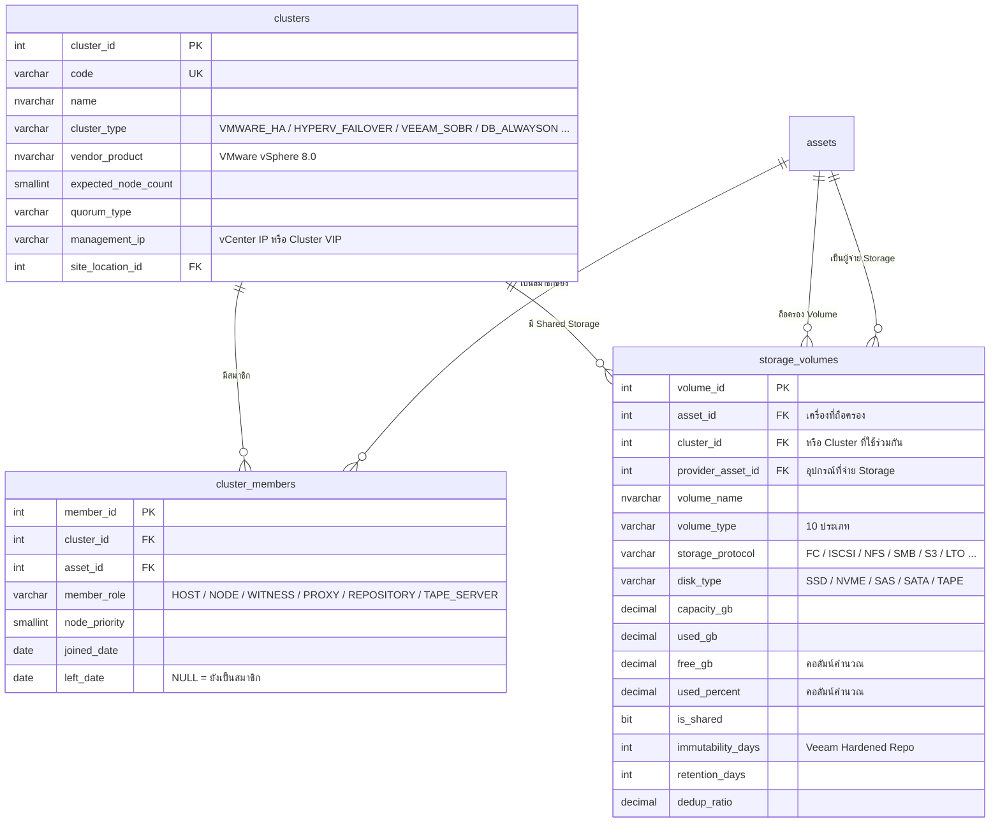
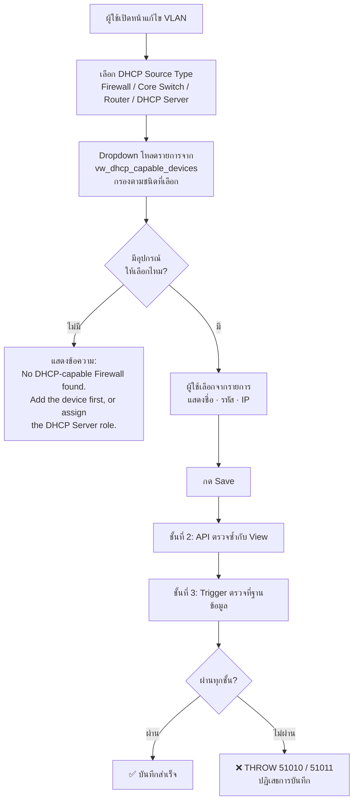

# โมดูล v1.2 — Device Classification · Storage & Cluster · DHCP Source Control
## KKND — IT Inventory Management System

| หัวข้อ | รายละเอียด |
|---|---|
| **เวอร์ชัน** | 1.2 (Draft — รออนุมัติ) |
| **สคริปต์** | `06-module-v1.2.sql` (รันหลัง `02` และ `04`) |
| **สิ่งที่เพิ่ม** | 6 ตาราง · 6 View · 3 Trigger |
| **สิ่งที่ถูกลบ** | `network_details.device_type` (ข้อความ) · `server_details.storage_config` · `server_details.storage_total_gb` |

---

## 1. สรุปคำตอบทั้ง 3 ข้อ

| ข้อ | คำถาม | สถานะเดิม | สิ่งที่ทำ |
|:---:|---|---|---|
| **1** | Server / Network แบ่งประเภทชัดเจนไหม | ❌ ไม่มีเลย | เพิ่ม `server_roles` (M:N) และ `network_device_types` (จัดกลุ่ม 6 Class) |
| **2** | Storage รองรับ Cluster VM / Veeam ไหม | ❌ ข้อความอิสระ ใช้ไม่ได้ | เพิ่ม `clusters` · `cluster_members` · `storage_volumes` |
| **3** | DHCP ต้องเลือกจากอุปกรณ์ที่เข้าข่ายเท่านั้น | ❌ เลือกเครื่องพิมพ์ได้ | เพิ่ม View กรองรายการ + Trigger บังคับที่ระดับฐานข้อมูล |

---

## 2. ข้อที่ 1 — การแบ่งประเภท Server และ Network

### 2.1 Server Roles — ทำไมต้องเป็นความสัมพันธ์แบบหลายต่อหลาย

> **เหตุผลที่ไม่ใช้ช่อง `server_role` ช่องเดียว:** ในองค์กรจริง เซิร์ฟเวอร์ 1 เครื่องมักทำหลายหน้าที่
> พร้อมกัน เช่น **Domain Controller + DNS + DHCP** อยู่ในเครื่องเดียว
> หากบังคับให้เลือกได้ค่าเดียว ผู้ใช้จะเลือก `AD_DC` แล้วข้อมูล DHCP จะหายไปจากระบบ
> ซึ่งกระทบข้อที่ 3 โดยตรง — เครื่องนั้นจะไม่ปรากฏในรายการ DHCP ที่เลือกได้

**โครงสร้าง:** `assets` ──< `server_role_assignments` >── `server_roles`

| ฟิลด์ใน `server_role_assignments` | ความหมาย |
|---|---|
| `is_primary` | ⭐ บทบาทหลัก **1 เครื่องมีได้เพียง 1 บทบาท** (บังคับด้วย Filtered Unique Index) ใช้แสดงในคอลัมน์ของตารางรายการ |
| `service_name` | ชื่อบริการจริง เช่น `MSSQLSERVER`, `SAP-PRD` |
| `service_port` | พอร์ตที่ให้บริการ เช่น `1433`, `443` |

### 2.2 บทบาท Server 32 ค่าตั้งต้น

| กลุ่ม | บทบาท |
|---|---|
| 🏗 **INFRASTRUCTURE** | AD Domain Controller · DNS · **DHCP** · File Server · Print Server · NTP · Certificate Authority · Virtualization Host · Container Host |
| 🗄 **DATA** | Database Server · Data Warehouse · Reporting / BI |
| 📦 **APPLICATION** | Application Server · Web Server · Mail Server · ERP · Middleware · API Gateway · Terminal / RDS |
| 🔒 **SECURITY** | Antivirus / EDR · SIEM / Log · RADIUS / AAA · PAM · Jump Host |
| 💾 **BACKUP** | Backup Server · Backup Proxy · Backup Repository Server · Tape Server |
| ⚙ **MANAGEMENT** | Monitoring · Patch Management · Deployment / Imaging · Other |

**สองฟิลด์ที่ทำให้ตารางนี้มีประโยชน์เกินกว่าการเป็นแค่ป้ายชื่อ**

| ฟิลด์ | ใช้ทำอะไร |
|---|---|
| `is_dhcp_provider` | ⭐ ตั้งเป็น `1` เฉพาะบทบาท `DHCP` — ใช้กรองรายการในข้อที่ 3 |
| `is_critical_service` | ระบุบริการที่ล่มแล้วกระทบทั้งองค์กร (AD, DNS, DHCP, Database, Mail ฯลฯ) → ใช้จัดลำดับความเร่งด่วนของการแจ้งเตือนวันหมดประกัน และเตือนก่อนเปลี่ยนสถานะเป็น Retired |

### 2.3 Network Device Types — จัดกลุ่มเป็น 6 Class

| Class | ประเภทอุปกรณ์ |
|---|---|
| 🌐 **NETWORK** | Core Switch · Distribution Switch · Layer 3 Switch · Access Switch · Router · Modem/ONU · Media Converter |
| 🛡 **SECURITY** | **Firewall · UTM · IPS/IDS · WAF · VPN Gateway · NAC · Proxy/Secure Web GW · Email Security GW · DDoS Mitigation** |
| 📡 **WIRELESS** | Wireless Access Point · Wireless Controller |
| ⚖ **OPTIMIZATION** | Load Balancer · SD-WAN Edge · WAN Optimizer |
| ☎ **VOICE** | IP-PBX · Voice Gateway |
| 🖥 **MANAGEMENT** | KVM Switch · Console / Terminal Server |

**3 ฟิลด์ที่เป็นหัวใจของการกรองรายการ**

| ฟิลด์ | ความหมาย | ตัวอย่าง |
|---|---|---|
| `is_layer3` | อุปกรณ์ทำ Routing ได้หรือไม่ | Core Switch = `1` · Access Switch = `0` |
| `can_be_gateway` | ⭐ เป็น Gateway ของ VLAN ได้หรือไม่ | Firewall = `1` · Wireless AP = `0` |
| `can_provide_dhcp` | ⭐ จ่าย DHCP ได้หรือไม่ | Router = `1` · WAF = `0` |

**ตารางการจับคู่ (Mapping)** — ทำให้ระบบตรวจสอบได้ว่าอุปกรณ์ที่เลือกตรงกับชนิดที่ระบุจริง

| Device Type | Class | L3 | Gateway | DHCP | `gateway_role_code` | `dhcp_source_code` |
|---|---|:---:|:---:|:---:|---|---|
| Core Switch | NETWORK | ✅ | ✅ | ✅ | `CORE_SWITCH` | `CORE_SWITCH` |
| Distribution Switch | NETWORK | ✅ | ✅ | ✅ | `L3_SWITCH` | `L3_SWITCH` |
| Layer 3 Switch | NETWORK | ✅ | ✅ | ✅ | `L3_SWITCH` | `L3_SWITCH` |
| Access Switch | NETWORK | ❌ | ❌ | ❌ | — | — |
| Router | NETWORK | ✅ | ✅ | ✅ | `ROUTER` | `ROUTER` |
| **Firewall** | SECURITY | ✅ | ✅ | ✅ | `FIREWALL` | `FIREWALL` |
| **UTM** | SECURITY | ✅ | ✅ | ✅ | `FIREWALL` | `FIREWALL` |
| VPN Gateway | SECURITY | ✅ | ✅ | ❌ | `FIREWALL` | — |
| Load Balancer | OPTIMIZATION | ✅ | ✅ | ❌ | `OTHER` | — |
| SD-WAN Edge | OPTIMIZATION | ✅ | ✅ | ✅ | `ROUTER` | `ROUTER` |
| Wireless Controller | WIRELESS | ✅ | ❌ | ✅ | — | `L3_SWITCH` |
| IPS/IDS · WAF · NAC · AP ฯลฯ | — | ❌ | ❌ | ❌ | — | — |

> **การเปลี่ยนแปลงโครงสร้าง:** `network_details.device_type` ที่เป็น `VARCHAR` พร้อม CHECK Constraint 6 ค่า
> ถูกแทนที่ด้วย `device_type_id` ที่เป็น Foreign Key — Admin จึงเพิ่มประเภทอุปกรณ์ใหม่ได้เองจากหน้า
> Master Data **โดยไม่ต้อง Deploy ระบบใหม่**

---

## 3. ข้อที่ 2 — Storage รองรับ Cluster VM และ Veeam Backup

### 3.1 ทำไมของเดิมใช้ไม่ได้

ฟิลด์เดิมคือ `storage_config NVARCHAR(300)` เก็บข้อความเช่น `"4× 1.92TB SSD RAID 10"`
ซึ่งมีปัญหา 5 ข้อ

| # | ปัญหา | ผลที่เกิด |
|---|---|---|
| 1 | เก็บ **Shared Storage** ไม่ได้ | Datastore ที่ 3 โฮสต์ใช้ร่วมกัน ต้องพิมพ์ซ้ำ 3 ครั้ง และไม่รู้ว่าเป็นก้อนเดียวกัน |
| 2 | **นับพื้นที่รวมไม่ได้** | ตอบไม่ได้ว่าองค์กรมีพื้นที่เท่าไร ใช้ไปเท่าไร |
| 3 | ไม่รู้ว่า **Storage มาจากไหน** | LUN นี้มาจาก SAN ตัวไหน ถ้า SAN ตัวนั้นล่มจะกระทบใครบ้าง |
| 4 | เก็บคุณสมบัติของ **Backup Repository** ไม่ได้ | Immutability กี่วัน · Retention กี่วัน · Dedup Ratio เท่าไร |
| 5 | **แจ้งเตือนพื้นที่ใกล้เต็มไม่ได้** | ข้อความอิสระคำนวณเปอร์เซ็นต์ไม่ได้ |

### 3.2 โครงสร้างใหม่ — 3 ตาราง



### 3.3 `volume_type` — 10 ประเภทที่รองรับ

| ประเภท | ใช้กับ |
|---|---|
| `LOCAL_DISK` | ดิสก์ในตัวเครื่อง |
| `SAN_LUN` | LUN จาก Storage Array ผ่าน FC หรือ iSCSI |
| `NAS_SHARE` | Share จาก NAS ผ่าน NFS หรือ SMB |
| `VM_DATASTORE` | ⭐ **Datastore ของ VMware / Hyper-V** |
| `CLUSTER_SHARED_VOLUME` | ⭐ **CSV ของ Windows Failover Cluster** |
| `BACKUP_REPOSITORY` | ⭐ **Veeam Backup Repository** |
| `SCALE_OUT_REPOSITORY` | ⭐ **Veeam SOBR** (รวมหลาย Extent) |
| `OBJECT_STORAGE` | S3 / MinIO / Wasabi |
| `TAPE_POOL` | Tape Library |
| `CLOUD_TIER` | Capacity Tier บนคลาวด์ |

### 3.4 กติกาที่ฐานข้อมูลบังคับ

| กติกา | Constraint |
|---|---|
| Volume ต้องผูกกับ **เครื่อง หรือ Cluster** อย่างน้อยหนึ่งอย่าง จะลอยอิสระไม่ได้ | `CK_vol_owner` |
| Volume ที่ `is_shared = 1` **ต้องผูกกับ Cluster** เสมอ | `CK_vol_shared_cluster` |
| `used_gb` ต้องไม่เกิน `capacity_gb` | `CK_vol_used` |
| ความจุต้องมากกว่า 0 | `CK_vol_capacity` |

### 3.5 ตัวอย่างที่ 1 — VMware Cluster 3 โหนด พร้อม Shared Datastore

```
Cluster : CL-VM-HQ · HQ Production VMware Cluster
          VMWARE_HA · VMware vSphere 8.0 · vCenter 10.10.10.50
          Expected 3 nodes · Quorum: Node Majority

Members ├─ SRV-2024-0011  ESXi-HOST-01   HOST   priority 1
        ├─ SRV-2024-0012  ESXi-HOST-02   HOST   priority 2
        └─ SRV-2024-0013  ESXi-HOST-03   HOST   priority 3

Shared Storage (ผูกกับ Cluster ไม่ใช่กับโฮสต์ตัวใดตัวหนึ่ง)
        └─ DS-PROD-01 · VM_DATASTORE · FC · SSD
           20,480 GB · ใช้ไป 14,336 GB · เหลือ 6,144 GB (70.0%)
           จ่ายโดย STG-2023-0002 (Dell PowerStore 1200T)
```

> **จุดที่แก้ปัญหาได้จริง:** Datastore ก้อนนี้ถูกบันทึกเพียง **แถวเดียว** ผูกกับ Cluster
> โฮสต์ทั้ง 3 เครื่องเห็นพื้นที่เดียวกัน และ **ระบบไม่นับซ้ำ 3 เท่า** ตอนคำนวณพื้นที่รวมขององค์กร
> — ซึ่งเป็นความผิดพลาดที่ระบบ Inventory ทั่วไปมักทำ

### 3.6 ตัวอย่างที่ 2 — Veeam Backup Server พร้อม Hardened Repository

```
Asset   : SRV-2024-0020 · VEEAM-BKP-01
Roles   : 🔵 Backup Server (primary) · Backup Repository Server

Volume  : REPO-HARDENED-01 · BACKUP_REPOSITORY · iSCSI · SATA
          102,400 GB · ใช้ไป 71,680 GB · เหลือ 30,720 GB (70.0%)
          จ่ายโดย STG-2023-0005 (Synology RS4021xs+)
          🔒 Immutability 14 วัน · Retention 90 วัน · Dedup 3.20× · เข้ารหัส ✅

สิ่งที่ปกป้องอยู่ (ใช้ asset_relationships เดิม ไม่ต้องสร้างตารางใหม่)
          SRV-2026-0031  DB-PROD-01   ← Backed Up By
          SRV-2026-0032  APP-PROD-02  ← Backed Up By
          CL-VM-HQ       VMware Cluster ← Backed Up By
```

**View `vw_backup_repositories` คำนวณ 2 สัญญาณเตือนให้อัตโนมัติ**

| สัญญาณ | เงื่อนไข | ความหมาย |
|---|---|---|
| `capacity_status` | ≥ 90% = `CRITICAL` · ≥ 80% = `WARNING` | พื้นที่สำรองข้อมูลใกล้เต็ม — งาน Backup กำลังจะล้มเหลว |
| `lacks_immutability` | `immutability_days` ว่างหรือเป็น 0 | ⚠️ **ความเสี่ยงต่อ Ransomware** — ข้อมูลสำรองถูกลบหรือเข้ารหัสทับได้ |

> สัญญาณที่สองเป็นสิ่งที่ผมเพิ่มให้เอง เพราะ Backup ที่ลบได้ ไม่ใช่ Backup
> — เป็นจุดที่ผู้ตรวจสอบด้านความปลอดภัยถามเป็นอันดับต้นๆ

### 3.7 สิ่งที่ถูกลบออกและเหตุผล

| ฟิลด์ที่ลบ | เหตุผล |
|---|---|
| `server_details.storage_config` | เป็นข้อความอิสระ หากเก็บไว้คู่กับ `storage_volumes` จะกลายเป็นข้อมูลสองแหล่งที่ขัดแย้งกันได้ |
| `server_details.storage_total_gb` | เป็นค่าที่คำนวณได้จากผลรวมของ Volume การเก็บไว้ซ้ำทำให้ข้อมูลเพี้ยนเมื่อมีการแก้ Volume |

> **ข้อยกเว้นที่ตั้งใจไว้:** `computer_details.storage_config` **ยังคงเป็นข้อความอิสระตามเดิม**
> เพราะเครื่อง PC/Notebook กว่า 1,200 เครื่องระบุแค่ `512GB NVMe` ก็เพียงพอ
> การบังคับให้สร้างแถว Volume ให้ทุกเครื่องเป็นภาระที่ไม่ได้ประโยชน์คุ้มกัน

---

## 4. ข้อที่ 3 — DHCP ต้องเลือกจากอุปกรณ์ที่เข้าข่ายเท่านั้น

### 4.1 กลไก 3 ชั้น



### 4.2 View `vw_dhcp_capable_devices` — แหล่งข้อมูลของ Dropdown

รวมอุปกรณ์จาก **2 ทาง** โดยยึดเงื่อนไขว่าต้อง**มีอยู่จริงในระบบและยังใช้งานอยู่**

| ที่มา | เงื่อนไข |
|---|---|
| **อุปกรณ์เครือข่าย** | `network_device_types.can_provide_dhcp = 1` |
| **เซิร์ฟเวอร์** | มีบทบาทที่ `server_roles.is_dhcp_provider = 1` (คือบทบาท `DHCP`) |

**เงื่อนไขร่วมที่บังคับทั้งสองทาง**

- `assets.is_deleted = 0` — ไม่แสดงรายการที่ถูกลบ
- `asset_statuses.is_operational = 1` — ❌ **ไม่แสดงเครื่องที่ Retired หรือ Disposed**

> ข้อสุดท้ายสำคัญมาก: การให้เลือก Firewall ที่ปลดระวางไปแล้วเป็น DHCP Server
> คือการบันทึกข้อมูลที่ผิดตั้งแต่วินาทีแรก

**ผลลัพธ์ที่ View คืนกลับมา** (ใช้แสดงใน Dropdown ตามที่ระบุว่าต้องเห็น Server name / Device name)

| คอลัมน์ | ตัวอย่าง |
|---|---|
| `display_label` | `Palo Alto PA-3220 (NET-2024-0001) · 10.10.0.1` |
| `device_kind` | `NETWORK` หรือ `SERVER` |
| `device_type_name` | `Firewall` หรือ `DHCP Server` |
| `dhcp_source_type` | `FIREWALL` — ใช้ตรวจว่าตรงกับที่ผู้ใช้เลือกไว้ |
| `device_hostname` · `device_ip` | `FW-HQ-01` · `10.10.0.1` |
| `location_name` | `HQ - Rack A1` |

### 4.3 Trigger ที่บังคับจริงในฐานข้อมูล

`trg_vlans_validate_device_refs` ตรวจ 5 เงื่อนไข

| รหัส | ตรวจอะไร | ข้อความ |
|---|---|---|
| `51010` | DHCP Server ที่เลือกอยู่ในรายการที่เข้าข่ายหรือไม่ | Selected DHCP server is not a DHCP-capable device |
| `51011` | ชนิดที่ระบุตรงกับชนิดของอุปกรณ์จริงหรือไม่ | DHCP source type does not match the selected device type |
| `51012` | เลือก `EXTERNAL` แต่ดันผูกกับอุปกรณ์ในระบบ | EXTERNAL must not reference an asset |
| `51013` | Gateway ที่เลือกทำหน้าที่ Gateway ได้หรือไม่ | Gateway device cannot act as a gateway (Layer 3 required) |
| `51014` | บทบาท Gateway ตรงกับชนิดอุปกรณ์หรือไม่ | Gateway device role does not match device type |

**ตัวอย่างที่ระบบจะปฏิเสธ**

| สิ่งที่พยายามบันทึก | ผลลัพธ์ |
|---|---|
| DHCP Server = เครื่องพิมพ์ `PER-2024-0088` | ❌ `51010` |
| DHCP Server = Access Switch (ไม่รองรับ DHCP) | ❌ `51010` |
| DHCP Server = เซิร์ฟเวอร์ที่ยังไม่ได้กำหนดบทบาท DHCP | ❌ `51010` |
| `dhcp_source_type = 'FIREWALL'` แต่เลือก Core Switch | ❌ `51011` |
| `dhcp_source_type = 'EXTERNAL'` แต่เลือกอุปกรณ์ในระบบ | ❌ `51012` |
| Gateway = Wireless Access Point | ❌ `51013` |
| DHCP Server = Firewall ที่สถานะ Disposed | ❌ `51010` |

### 4.4 Trigger ป้องกันการถอนบทบาทที่ยังถูกใช้อยู่

`trg_server_roles_protect_dhcp` — หากมี VLAN อ้างอิงเซิร์ฟเวอร์เครื่องหนึ่งเป็นแหล่ง DHCP อยู่
**จะถอนบทบาท DHCP Server ออกจากเครื่องนั้นไม่ได้** (รหัส `51016`)

> ป้องกันสถานการณ์ที่ผู้ใช้แก้ข้อมูลเซิร์ฟเวอร์แล้วทำให้ข้อมูล VLAN กลายเป็นค่าที่ไม่ถูกต้อง
> โดยไม่รู้ตัว — ฐานข้อมูลจะบอกให้แก้ VLAN ก่อน

### 4.5 หน้าจอที่เปลี่ยนไป

```
│  ┌─ IP Assignment ──────────────────────────────────────────────────────┐  │
│  │  Assignment Mode *                                                    │  │
│  │  ( ) Static only    (●) Mixed (Static + DHCP)    ( ) DHCP only        │  │
│  │                                                                       │  │
│  │  DHCP Source Type *          DHCP Device *                            │  │
│  │  [▾ Firewall            ]    [▾ Select a firewall...            ]     │  │
│  │                              ┌──────────────────────────────────────┐ │  │
│  │                              │ 🛡 Palo Alto PA-3220                 │ │  │
│  │                              │    NET-2024-0001 · 10.10.0.1         │ │  │
│  │                              │    Firewall · HQ - Rack A1           │ │  │
│  │                              ├──────────────────────────────────────┤ │  │
│  │                              │ 🛡 FortiGate 200F                    │ │  │
│  │                              │    NET-2024-0007 · 10.20.0.1         │ │  │
│  │                              │    UTM · DR Site                     │ │  │
│  │                              └──────────────────────────────────────┘ │  │
│  │                              ⓘ Showing only devices that can provide  │  │
│  │                                DHCP and are currently operational     │  │
│  └───────────────────────────────────────────────────────────────────────┘  │
```

**กรณีไม่มีอุปกรณ์ให้เลือก**

```
│  │  DHCP Device *                                                        │  │
│  │  [▾ No eligible device found                              ] (disabled)│  │
│  │  ⚠ No DHCP-capable firewall exists in the system.                     │  │
│  │    → Add the firewall as an asset first, or                           │  │
│  │    → Assign the "DHCP Server" role to an existing server              │  │
│  │    ( Go to Assets )                                                   │  │
```

> **หลักการที่ใช้:** สถานะว่างเปล่าต้อง**บอกวิธีแก้** ไม่ใช่แค่บอกว่าไม่มี
> ตามที่กำหนดไว้ใน Design System §6.8

---

## 5. ผลกระทบต่อหน้าจอเดิม

### 5.1 หน้า Asset Form — Server

```
│  ┌─ ② Technical Specification ─────────────────── [Server fields] ────┐   │
│  │  Server Type *      CPU                    RAM (GB)                 │   │
│  │  (●) Physical       [Xeon Gold 6338     ]  [256      ]              │   │
│  │  ( ) Virtual                                                        │   │
│  │                                                                     │   │
│  │  Server Roles *                                          ⭐ ใหม่     │   │
│  │  [✓] AD Domain Controller  ← ( ● Primary )                          │   │
│  │  [✓] DNS Server                                                     │   │
│  │  [✓] DHCP Server            ⓘ This server will appear in            │   │
│  │  [ ] File Server              VLAN DHCP source lists                │   │
│  │  [ ] Database Server        ( + Add role )                          │   │
│  └─────────────────────────────────────────────────────────────────────┘   │
│  ┌─ ③ Storage Volumes ──────────────────────────────── ⭐ ใหม่ ───────┐   │
│  │  ┌────────────────┬──────────────┬──────────┬────────┬───────────┐ │   │
│  │  │ VOLUME         │ TYPE         │ CAPACITY │ USED   │ PROVIDER  │ │   │
│  │  ├────────────────┼──────────────┼──────────┼────────┼───────────┤ │   │
│  │  │ C:\ (System)   │ LOCAL_DISK   │  240 GB  │ 45%    │ —         │ │   │
│  │  │ DS-PROD-01     │ VM_DATASTORE │ 20 TB    │ 70%    │ PowerStore│ │   │
│  │  └────────────────┴──────────────┴──────────┴────────┴───────────┘ │   │
│  │                                            [ + Add Volume ]         │   │
│  └─────────────────────────────────────────────────────────────────────┘   │
```

### 5.2 หน้า Asset List — คอลัมน์ที่เปลี่ยน

| เดิม | ใหม่ |
|---|---|
| Name บรรทัดบน · Serial บรรทัดล่าง | **Name บรรทัดบน · 🏷 Primary Role หรือ Device Type บรรทัดล่าง** |

ทำให้กวาดสายตาดูรายการ Server แล้วรู้ทันทีว่าเครื่องไหนทำหน้าที่อะไร โดยไม่ต้องคลิกเข้าไปดู

### 5.3 เมนูที่เพิ่ม

```
🖥 Assets
💿 Software
🌐 Network
   ├─ VLANs
   └─ IP Allocation
🧩 Infrastructure          ← ใหม่
   ├─ Clusters
   └─ Storage Volumes
📊 Reports
   └─ Backup Repositories  ← ใหม่
```

---

## 6. สรุปสถานะฐานข้อมูลหลัง v1.2

| ประเภท | v1.1 | **v1.2** | ที่เพิ่ม |
|---|:---:|:---:|---|
| ตาราง | 29 | **35** | `server_roles` · `server_role_assignments` · `network_device_types` · `clusters` · `cluster_members` · `storage_volumes` |
| View | 9 | **15** | `vw_dhcp_capable_devices` · `vw_gateway_capable_devices` · `vw_server_roles_summary` · `vw_asset_storage_summary` · `vw_cluster_overview` · `vw_backup_repositories` |
| Stored Procedure | 3 | 3 | — |
| Function | 4 | 4 | — |
| Trigger | 1 | **4** | `trg_vlans_validate_device_refs` · `trg_vlan_ranges_validate_dhcp` · `trg_server_roles_protect_dhcp` |

---

## 7. ผลกระทบต่อแผนงาน

| Sprint | งานที่เพิ่ม | ประเมิน |
|:---:|---|---|
| **0** | Migration ของโมดูล v1.2 และ Seed Data 59 รายการ | +0.5 วัน |
| **2** | Master Data: Server Roles และ Network Device Types | +1 วัน |
| **2** | ฟอร์ม Server เพิ่มส่วนเลือกบทบาทแบบหลายค่า | +1 วัน |
| **3** | หน้า Storage Volumes และ Clusters (CRUD + สรุปพื้นที่) | +3 วัน |
| **3** | Dropdown DHCP/Gateway ที่กรองจาก View + จัดการข้อผิดพลาดจาก Trigger | +1.5 วัน |
| **5** | รายงาน Backup Repositories และ Storage Capacity | +1 วัน |
| **6** | Template Excel สำหรับ Storage Volume และ Server Role | +1 วัน |
| | **รวมเพิ่มจาก v1.1** | **~9 วันทำงาน** |

> **รวมงานที่เพิ่มจากแผนเดิมทั้งหมด (v1.1 + v1.2): ~17 วันทำงาน**
> ซึ่งเป็นการลงทุนที่คุ้มค่า เพราะทั้งสองโมดูลแก้ปัญหาที่หากไม่ทำตอนนี้
> จะต้องรื้อโครงสร้างฐานข้อมูลตอนระบบใช้งานจริงแล้ว

---

*เอกสารนี้เป็นส่วนขยายของ Phase 3 — Database Architecture*
