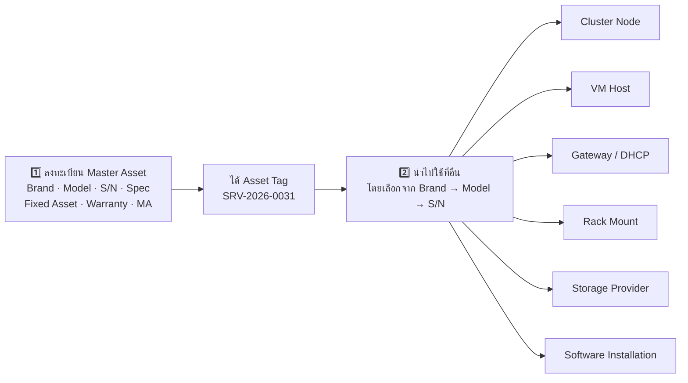
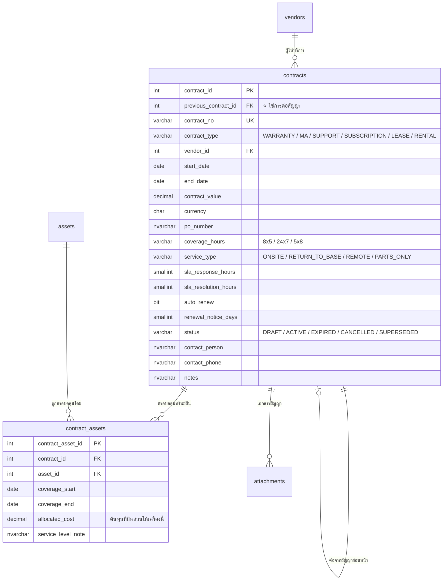
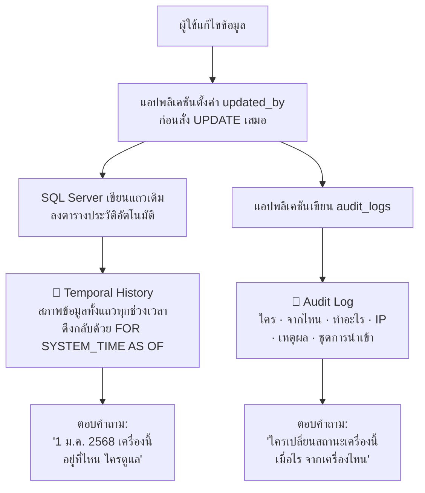

# ข้อเสนอ v1.4 — Master Asset · Contract & MA History · Full Change History
## KKND — IT Inventory Management System

| หัวข้อ | รายละเอียด |
|---|---|
| **สถานะ** | 📋 **ข้อเสนอ — ยังไม่เขียน SQL** |
| **ต่อจาก** | `08-taxonomy-proposal.md` (v1.3) |
| **ครอบคลุม** | Master Server · สัญญา MA พร้อมประวัติการต่อ · ประวัติการแก้ไขทั้งระบบ · ความเห็นเรื่องการเก็บข้อมูล |

---

## 1. แนวคิด Master Asset — "ลงทะเบียนก่อน แล้วค่อยนำไปใช้"

### 1.1 หลักการ



> **หลักการสำคัญ:** ทุกจุดในระบบที่ต้องอ้างถึงเครื่องเซิร์ฟเวอร์ **ต้องเลือกจากทะเบียนเท่านั้น
> ห้ามพิมพ์ชื่อเครื่องเป็นข้อความอิสระโดยเด็ดขาด** — เพราะการพิมพ์เองทำให้เกิด
> `DB-PROD-01`, `DB PROD 01`, `db-prod-1` ที่ระบบมองเป็นคนละเครื่อง

### 1.2 ตัวเลือกแบบ 3 ชั้นตามที่สั่ง

```
เพิ่ม Node เข้า Cluster CL-VM-HQ
┌──────────────────────────────────────────────────────────────────┐
│  Brand *              Model *               Serial Number *      │
│  [▾ Dell         ]    [▾ PowerEdge R750 ]   [▾ Select...    ]    │
│                                             ┌──────────────────┐ │
│                                             │ 7K2LM93          │ │
│                                             │ SRV-2026-0031    │ │
│                                             │ DB-PROD-01       │ │
│                                             │ HQ · Rack A2 U37 │ │
│                                             ├──────────────────┤ │
│                                             │ HP88XQ2          │ │
│                                             │ SRV-2026-0032    │ │
│                                             │ APP-PROD-02      │ │
│                                             │ HQ · Rack A2 U35 │ │
│                                             └──────────────────┘ │
│  ⓘ แสดงเฉพาะเซิร์ฟเวอร์ที่ลงทะเบียนแล้ว · เป็น Physical ·         │
│    สถานะใช้งานได้ · และยังไม่ได้เป็นสมาชิก Cluster อื่น            │
└──────────────────────────────────────────────────────────────────┘
```

| เงื่อนไขการกรอง | เหตุผล |
|---|---|
| ลงทะเบียนแล้วและยังไม่ถูกลบ | ป้องกันอ้างถึงข้อมูลที่ถูกลบ |
| หมวด = Server และประเภท = Physical | VM เป็นสมาชิก Cluster โดยตรงไม่ได้ |
| สถานะ `is_operational = 1` | ❌ ไม่ให้เลือกเครื่องที่ Retired / Disposed |
| ยังไม่เป็นสมาชิก Cluster เดียวกัน | ป้องกันเพิ่มซ้ำ |
| Brand แสดงเฉพาะที่มีเครื่องอยู่จริง | เลือก Dell แล้วต้องมีเครื่อง Dell ให้เลือกจริง |

### 1.3 🆕 ฟิลด์ที่เพิ่มเข้า Master Asset

| กลุ่ม | ฟิลด์ | เหตุผลที่ต้องมี |
|---|---|---|
| **รหัสอ้างอิง** | `fixed_asset_no` ⭐ | **เลขครุภัณฑ์จากฝ่ายบัญชี** — ตัวเชื่อมเดียวระหว่างทะเบียน IT กับทะเบียนทรัพย์สินของบริษัท ผู้ตรวจสอบถามหาเสมอ |
| | `service_tag` | Dell ใช้ Service Tag · HPE ใช้ Serial — **หลายองค์กรต้องเก็บทั้งสองค่า** |
| | `system_uuid` | UUID ของเครื่อง ใช้จับคู่กับข้อมูลจากระบบอื่นในอนาคต |
| **วันที่ในวงจรชีวิต** | `purchase_date` | วันที่สั่งซื้อ / วันในใบกำกับภาษี |
| | `received_date` | วันรับของเข้าคลัง |
| | `install_date` | วันติดตั้งเสร็จ |
| | `service_start_date` ⭐ | **วันเริ่มใช้งานจริง (Start Date)** — ใช้นับอายุการใช้งาน |
| | `retire_date` · `disposal_date` | วันปลดระวาง / วันตัดจำหน่าย |
| **บัญชี** | `acquisition_cost` | ราคาทุน |
| | `capitalization_date` | วันบันทึกเป็นสินทรัพย์ |
| | `useful_life_years` · `salvage_value` | อายุการใช้งานตามบัญชี · มูลค่าซาก |
| | `depreciation_method` | `STRAIGHT_LINE` · `DECLINING` · `NONE` |
| | `cost_center` · `budget_year` | ศูนย์ต้นทุนและปีงบประมาณ |

> 💬 **ความเห็นของผม:** การแยกวันที่ออกเป็น 6 ค่าดูเหมือนเยอะเกินจำเป็น
> แต่ในการตรวจสอบจริง คำถามที่ถูกถามคือ **"เครื่องนี้ใช้งานมากี่ปีแล้ว"** ซึ่งต้องนับจาก
> `service_start_date` **ไม่ใช่** `purchase_date` — เครื่องที่ซื้อมาตั้งแต่ปี 2565
> แต่เพิ่งเปิดใช้ปี 2567 มีอายุการใช้งาน 2 ปี ไม่ใช่ 4 ปี
> **การใช้ช่องเดียวทำให้ตอบผิดทุกครั้ง**

---

## 2. ⭐ สัญญาและการต่อ MA — จาก "คู่วันที่" เป็น "เส้นเวลา"

### 2.1 ปัญหาของโครงสร้างปัจจุบัน

```
โครงสร้างเดิม (ผิด)
assets
  coverage_start_date  2025-10-01
  coverage_end_date    2026-09-30     ← ต่อ MA ปีหน้า ค่านี้ถูกเขียนทับ
                                         ข้อมูลปี 2568 หายไปตลอดกาล
```

**คำถามที่ตอบไม่ได้เลย:** MA ปีที่แล้วซื้อจากใคร · จ่ายไปเท่าไร · SLA เป็นแบบไหน ·
ต่อสัญญามาแล้วกี่ครั้ง · ราคาขึ้นทุกปีเท่าไร · ปีไหนที่เครื่องหลุด MA ไปช่วงหนึ่ง

### 2.2 โครงสร้างที่เสนอ — 2 ตาราง



### 2.3 ทำไมต้องแยกเป็น 2 ตาราง

> **เพราะสัญญา MA หนึ่งฉบับมักครอบคลุมหลายเครื่องพร้อมกัน**
> เช่น PO เดียวต่อ MA ให้เซิร์ฟเวอร์ 20 เครื่อง — หากออกแบบเป็นฟิลด์ในตาราง `assets`
> จะต้องกรอกเลขที่สัญญา ผู้ขาย ราคา SLA ซ้ำ 20 รอบ และเวลาต่อสัญญาต้องแก้ 20 แถว
> ซึ่ง**ผิดพลาดแน่นอน**

### 2.4 ⭐ โซ่การต่อสัญญา (Renewal Chain)

`previous_contract_id` ชี้กลับหาสัญญาฉบับก่อนหน้า ทำให้ได้ประวัติเต็มโดยไม่ต้องมีตารางเพิ่ม

```
SRV-2026-0031 · Dell PowerEdge R750 · S/N 7K2LM93
─────────────────────────────────────────────────────────────────────────
📄 WARRANTY  ProSupport 3Y     15 Mar 22 – 14 Mar 25   ฿      0   (ติดมากับเครื่อง)
    ↓ ต่อเป็น
📄 MA #1     MA-2025-0142      15 Mar 25 – 14 Mar 26   ฿ 42,000   SiS · 24x7 · Onsite 4h
    ↓ ต่อเป็น
📄 MA #2     MA-2026-0311      15 Mar 26 – 14 Mar 27   ฿ 48,000   SiS · 24x7 · Onsite 4h
    ⚠️ ราคาขึ้น 14.3% จากปีก่อน
─────────────────────────────────────────────────────────────────────────
รวมค่าดูแลรักษาสะสม 4 ปี : ฿ 90,000  (31.6% ของราคาเครื่อง ฿ 285,000)
สถานะปัจจุบัน : 🟠 หมดอายุใน 179 วัน · Auto-renew: ปิด
```

**สิ่งที่ระบบคำนวณให้อัตโนมัติจากโซ่นี้**

| ค่า | ประโยชน์ |
|---|---|
| จำนวนครั้งที่ต่อสัญญา | ประวัติความสัมพันธ์กับผู้ขาย |
| อัตราการขึ้นราคาแต่ละปี | ⭐ **ใช้ต่อรองราคาตอนต่อสัญญา** |
| ค่าดูแลรักษาสะสมตลอดอายุ | ⭐ **ใช้ตัดสินใจว่าควรต่อ MA หรือซื้อเครื่องใหม่** |
| ช่วงที่ไม่มีสัญญาคุ้มครอง (Coverage Gap) | ⚠️ ชี้ให้เห็นช่วงที่เครื่องเสี่ยงโดยไม่มีใครรู้ |

### 2.5 การ Renew Software ใช้โครงสร้างเดียวกันทั้งหมด

> คุณสั่งว่าต้องเก็บ **"การ renew software นั้นๆ"** ด้วย — **ใช้ตาราง `contracts` เดียวกันได้เลย**
> โดยตั้ง `contract_type = 'SUBSCRIPTION'` และผูกกับ Asset ที่เป็น Software License

```
SFT-2024-0005 · VMware vSphere Standard · 60 Seats
─────────────────────────────────────────────────────────────────────
📄 SUBSCRIPTION  SUB-2024-0088   01 Dec 24 – 30 Nov 25   ฿ 380,000   60 seats
    ↓ ต่อเป็น
📄 SUBSCRIPTION  SUB-2025-0203   01 Dec 25 – 30 Nov 26   ฿ 420,000   60 seats
    ⚠️ ราคาขึ้น 10.5% · จำนวน Seat เท่าเดิม
─────────────────────────────────────────────────────────────────────
```

> ✅ **ข้อดีที่ได้ฟรี:** ระบบแจ้งเตือนวันหมดอายุที่ทำไว้แล้ว **ทำงานกับทั้ง Warranty, MA
> และ Software Subscription ด้วยกลไกเดียวกัน** ไม่ต้องเขียนโค้ดเพิ่มแม้แต่บรรทัดเดียว

### 2.6 ผลกระทบต่อโครงสร้างเดิม

| เดิม | ใหม่ |
|---|---|
| `assets.coverage_start_date` · `coverage_end_date` | ❌ **ลบออก** — กลายเป็นค่าที่อ่านจาก `contract_assets` ของสัญญาที่ยัง Active |
| `assets.support_level` | ❌ ลบออก — ย้ายไป `contracts.coverage_hours` + `service_type` + SLA |
| View แจ้งเตือนวันหมดอายุ | ♻️ อ่านจาก `contract_assets` แทน (มี Index ของตัวเอง) |

> ⚠️ **ขอการยืนยัน:** การลบ 2 ฟิลด์นี้ทำให้ต้องแก้ View และหน้าเว็บที่อ้างถึง
> แต่เป็นสิ่งจำเป็น เพราะการเก็บไว้ทั้งสองที่จะทำให้ข้อมูลขัดแย้งกันแน่นอน

---

## 3. ⭐ ประวัติการแก้ไขทั้งระบบ — ข้อเสนอเชิงสถาปัตยกรรม

### 3.1 เปรียบเทียบ 3 ทางเลือก

| ทางเลือก | ตอบได้ว่า "ใครแก้อะไร" | ตอบได้ว่า **"ข้อมูลทั้งแถว ณ วันนั้นเป็นอย่างไร"** | งานพัฒนา | แก้ไขย้อนหลังได้ไหม |
|---|:---:|:---:|---|---|
| `audit_logs` อย่างเดียว (ปัจจุบัน) | ✅ | ⚠️ ต้องไล่ประกอบ JSON ย้อนหลังทีละรายการ **ทำจริงไม่ไหว** | มีอยู่แล้ว | ❌ ป้องกันแล้ว |
| ตาราง `*_history` ที่เขียนเอง | ✅ | ✅ | 🔴 ต้องเขียน Trigger ทุกตาราง ~44 ตัว · พลาดง่าย | ⚠️ แล้วแต่สิทธิ์ |
| ⭐ **Temporal Tables ของ SQL Server** | ✅ (ผ่าน `updated_by`) | ✅ **คำสั่งเดียวจบ** | 🟢 เปิดใช้ด้วย `SYSTEM_VERSIONING = ON` | ❌ **แก้ไม่ได้เลยขณะเปิดใช้งาน** |

### 3.2 ข้อเสนอ: ใช้ทั้งสองอย่างคู่กัน



| ระบบ | หน้าที่ | เปรียบเทียบง่ายๆ |
|---|---|---|
| **Temporal Table** | เก็บ**สภาพของข้อมูล**ทุกช่วงเวลา | เหมือนภาพถ่ายทุกครั้งที่มีการเปลี่ยนแปลง |
| **Audit Log** | เก็บ**เหตุการณ์**และผู้กระทำ | เหมือนสมุดบันทึกว่าใครมาทำอะไรตอนไหน |

### 3.3 ตัวอย่างพลังของ Temporal Table

```sql
-- ข้อมูลเครื่องนี้ ณ วันที่ 1 มกราคม 2568 เป็นอย่างไร
SELECT * FROM dbo.assets
  FOR SYSTEM_TIME AS OF '2025-01-01T00:00:00+07:00'
WHERE asset_tag = 'SRV-2026-0031';

-- ประวัติการเปลี่ยนแปลงทั้งหมดของเครื่องนี้ พร้อมผู้แก้ไข
SELECT valid_from, valid_to, status_id, location_id, owner_user_id, updated_by
FROM dbo.assets FOR SYSTEM_TIME ALL
WHERE asset_tag = 'SRV-2026-0031'
ORDER BY valid_from;

-- ปีที่แล้วเรามีเซิร์ฟเวอร์กี่เครื่อง (ตอบคำถามผู้ตรวจสอบได้ทันที)
SELECT COUNT(*) FROM dbo.assets
  FOR SYSTEM_TIME AS OF '2025-09-16T00:00:00+07:00'
WHERE category_id = 1 AND is_deleted = 0;
```

> 🔒 **ข้อดีด้านความน่าเชื่อถือ:** ขณะที่ `SYSTEM_VERSIONING = ON`
> **ไม่มีใครแก้ไขหรือลบข้อมูลในตารางประวัติได้เลย แม้แต่ `db_owner`**
> ต้องปิดระบบ Versioning ก่อน ซึ่งการปิดนั้นถูกบันทึกไว้ใน SQL Server Log
> — ตรงตามที่ผู้ตรวจสอบต้องการพอดี

### 3.4 ⚠️ ข้อควรระวังที่ต้องรู้ก่อนตัดสินใจ

| ข้อควรระวัง | ผลกระทบ | วิธีรับมือ |
|---|---|---|
| **Temporal บันทึก "เมื่อไร" แต่ไม่บันทึก "ใคร"** | หากไม่ระวัง จะได้ประวัติที่ไม่รู้ว่าใครแก้ | ⭐ **บังคับให้แอปตั้งค่า `updated_by` ทุกครั้งก่อน UPDATE** ค่านี้จะถูกคัดลอกเข้าตารางประวัติเอง |
| ขนาดข้อมูลเติบโต | แก้ 1 ครั้ง = เพิ่ม 1 แถวในตารางประวัติ | ที่ ~2,350 เครื่อง × แก้ 10 ครั้ง/ปี ≈ **24,000 แถว/ปี ≈ 30 MB/ปี — ไม่มีนัยสำคัญ** |
| การแก้โครงสร้างตารางยุ่งยากขึ้น | ต้องปิด Versioning ก่อน `ALTER TABLE` บางแบบ | รวมไว้ในขั้นตอน Migration มาตรฐาน |
| ใช้กับ `ON DELETE CASCADE` ไม่ได้ | — | ✅ **ระบบเราไม่ใช้ CASCADE อยู่แล้วโดยเจตนา** |
| ตารางที่มี Trigger ต้องระวังลำดับ | — | ตรวจตอนทดสอบ |

### 3.5 ตารางที่ควรเปิด Temporal

| กลุ่ม | ตาราง | เหตุผล |
|---|---|:---:|
| 🔴 **จำเป็น** | `assets` · ตารางขยายทั้ง 8 · `contracts` · `contract_assets` | ข้อมูลหลักที่ถูกตรวจสอบ |
| 🔴 **จำเป็น** | `software_installations` · `ip_addresses` · `rack_mounts` | ⭐ ตามที่สั่งว่าการผูก Software กับ Server ต้องมีประวัติ |
| 🟠 **ควรมี** | `server_role_assignments` · `cluster_members` · `storage_volumes` · `vlans` · `vlan_ip_ranges` | ข้อมูลโครงสร้างพื้นฐานที่เปลี่ยนบ่อย |
| 🟡 **มีก็ดี** | `users` · Master Data ทั้งหมด | ปริมาณน้อยมาก เปิดไว้แทบไม่มีต้นทุน |
| ⚪ **ไม่ต้อง** | `audit_logs` · `notifications` · `notification_history` | Append-only อยู่แล้ว ไม่มีการแก้ไข |

---

## 4. ⭐ ประวัติการผูก Software กับ Server

### 4.1 โครงสร้างปัจจุบันเก็บได้แล้วบางส่วน

ตาราง `software_installations` ใช้ `removed_date` แทนการลบแถว จึงมีประวัติอยู่แล้ว
เมื่อเปิด Temporal Table เพิ่ม จะได้ประวัติสมบูรณ์

```
SRV-2026-0031 · DB-PROD-01 — ประวัติซอฟต์แวร์
──────────────────────────────────────────────────────────────────────────
🟢 Windows Server 2022 Std    ติดตั้ง 20 Mar 22              ใช้งานอยู่
🟢 SQL Server 2022 Ent        ติดตั้ง 20 Mar 22              ใช้งานอยู่
   └─ Subscription SUB-2024-0088  01 Dec 24 – 30 Nov 25  ฿ 380,000
   └─ Subscription SUB-2025-0203  01 Dec 25 – 30 Nov 26  ฿ 420,000  ← ปัจจุบัน
🟢 Veeam Backup 12.1          ติดตั้ง 05 Jun 24              ใช้งานอยู่
⚫ Symantec Endpoint 14       ติดตั้ง 20 Mar 22 · ถอน 15 Jan 25  (นภา ศรีสุข)
   └─ เหตุผล: เปลี่ยนไปใช้ CrowdStrike
🟢 CrowdStrike Falcon 7.x     ติดตั้ง 15 Jan 25              ใช้งานอยู่
──────────────────────────────────────────────────────────────────────────
```

### 4.2 ฟิลด์ที่เสนอให้เพิ่ม

| ฟิลด์ | เหตุผล |
|---|---|
| `removal_reason` | ทำไมถึงถอนออก — ข้อมูลที่มีค่ามากตอนตรวจสอบ License |
| `license_key_used` | กรณีใช้ Key คนละตัวกับ Key หลักของ License |
| `activation_date` | วัน Activate ซึ่งอาจต่างจากวันติดตั้ง |

---

## 5. 💬 ความเห็นเพิ่มเติมเรื่องการเก็บข้อมูล

คุณขอความเห็น ผมจึงเรียงตามลำดับความสำคัญจากประสบการณ์ระบบลักษณะนี้

### 5.1 🔴 ควรทำแน่นอน

#### (1) เก็บชิ้นส่วนที่เปลี่ยนได้แยกเป็นรายการ — ตาราง `asset_components`

> **เหตุผล:** เมื่อดิสก์ลูกหนึ่งเสียและถูกเปลี่ยนภายใต้ MA ระบบต้องบันทึกได้ว่า
> **ดิสก์ลูกเดิม S/N อะไร ลูกใหม่ S/N อะไร เปลี่ยนวันไหน ใครเปลี่ยน**
> — หากเก็บสเปกเป็นข้อความรวม `"4× 1.92TB SSD"` จะทำไม่ได้เลย
> และเวลาตรวจสอบจะพบว่าจำนวนดิสก์ในระบบไม่ตรงกับของจริง

| ฟิลด์ | ตัวอย่าง |
|---|---|
| `component_type` | `CPU` · `RAM` · `DISK` · `PSU` · `NIC` · `GPU` · `BATTERY` · `FAN` · `RAID_CARD` |
| `slot_position` | `DIMM_A1` · `Bay 3` · `PCIe Slot 2` |
| `manufacturer` · `model` · `serial_number` | ยี่ห้อ รุ่น และหมายเลขเครื่องของชิ้นส่วน |
| `capacity_spec` | `1.92TB SSD SAS` · `32GB DDR4-3200` |
| `install_date` · `remove_date` | ช่วงเวลาที่ติดตั้งอยู่ |
| `replacement_reason` | `FAILURE` · `UPGRADE` · `PREVENTIVE` · `RECALL` |
| `is_under_warranty` · `warranty_end` | ชิ้นส่วนบางชิ้นมีประกันของตัวเอง |

#### (2) บันทึกการซ่อมบำรุงและเหตุขัดข้อง — ตาราง `maintenance_records`

> **เหตุผล:** คุณกำลังจ่ายค่า MA อยู่ แต่ถ้าไม่บันทึกว่าเรียกใช้บริการกี่ครั้ง
> ผู้ขายตอบสนองภายใน SLA หรือไม่ **คุณจะไม่มีหลักฐานตอนต่อรองราคาปีหน้าเลย**

| ฟิลด์ | ประโยชน์ |
|---|---|
| `record_type` | `CORRECTIVE` · `PREVENTIVE` · `UPGRADE` · `INSPECTION` |
| `contract_id` 🔗 | ⭐ **ผูกกับสัญญา MA ที่ใช้สิทธิ์** |
| `reported_at` · `responded_at` · `resolved_at` | ⭐ **ใช้วัดว่าผู้ขายทำได้ตาม SLA จริงไหม** |
| `downtime_minutes` | เวลาที่ระบบหยุดทำงาน — ใช้คำนวณ Availability |
| `vendor_case_no` · `technician_name` | อ้างอิงกับผู้ขาย |
| `symptom` · `root_cause` · `action_taken` | องค์ความรู้ที่สะสมไว้ใช้ครั้งหน้า |
| `cost` · `is_billable` | ค่าใช้จ่ายที่อยู่นอกความคุ้มครอง |

#### (3) ทุกค่าที่ "วัดมา" ต้องมีวันที่วัดกำกับเสมอ

> ตัวเลข `used_gb = 71680` โดยไม่มีวันที่วัด **คือข้อมูลที่หลอกลวง** เพราะอาจวัดไว้ตั้งแต่ปีที่แล้ว
> ผมใส่ `last_measured_at` ให้ `storage_volumes` ไปแล้ว และเสนอให้ใช้หลักเดียวกันกับทุกค่าที่วัดได้

| ค่าที่วัดได้ | ฟิลด์วันที่ที่ต้องคู่กัน |
|---|---|
| `used_gb` ของ Storage | `last_measured_at` |
| `page_counter` ของเครื่องพิมพ์ | `counter_read_date` |
| `current_load_percent` ของ UPS | `load_measured_at` |
| `seats_used` ของ Software | คำนวณสดอยู่แล้ว ไม่ต้องมี |

#### (4) แยก "ค่าที่ควรเป็นตามสเปก" ออกจาก "ค่าที่เป็นจริง"

| แหล่ง | ตัวอย่าง |
|---|---|
| **สเปกตามรุ่น** (`device_models`) | Dell R750 รองรับ RAM สูงสุด 8,192 GB · มี 2 Socket · สูง 2U |
| **ค่าจริงของเครื่องนี้** (`assets` + `server_details`) | เครื่องนี้ใส่ RAM 256 GB · ใส่ CPU 2 ตัว |

> ระบบแสดงได้ว่า **"เครื่องนี้ยังขยาย RAM ได้อีก"** ซึ่งเป็นข้อมูลที่ใช้วางแผนงบประมาณได้จริง

### 5.2 🟠 ควรพิจารณา

| # | ข้อเสนอ | ประโยชน์ |
|---|---|---|
| 5 | **มุมมองต้นทุนรวมตลอดอายุ (TCO)** — รวมราคาซื้อ + ค่า MA ทุกปี + ค่าซ่อมนอกประกัน | ⭐ ตอบคำถาม **"ควรต่อ MA หรือซื้อเครื่องใหม่"** ด้วยตัวเลข ไม่ใช่ความรู้สึก |
| 6 | **มูลค่าตามบัญชี (Book Value)** คำนวณจากค่าเสื่อมราคาแบบเส้นตรง | เห็นว่าเครื่องที่ตัดค่าเสื่อมหมดแล้วแต่ยังจ่าย MA แพงอยู่ |
| 7 | **ไฟล์แนบผูกกับ "สัญญา" ไม่ใช่แค่ "เครื่อง"** | สัญญา MA ฉบับเดียวครอบคลุม 20 เครื่อง — แนบไฟล์ครั้งเดียวพอ ไม่ต้องแนบ 20 รอบ |
| 8 | **ประวัติ Firmware และ Patch** | ตอบผู้ตรวจสอบได้ว่าอุดช่องโหว่ CVE เมื่อไร |
| 9 | **แจ้งเตือนเมื่อสัญญามีช่องว่าง (Coverage Gap)** | ตรวจจากโซ่สัญญาว่ามีช่วงที่ไม่มีใครคุ้มครองหรือไม่ |
| 10 | **อัตราแลกเปลี่ยน ณ วันซื้อ** สำหรับอุปกรณ์นำเข้า | ราคาในสกุลต่างประเทศเปรียบเทียบข้ามปีได้ |

### 5.3 ⚪ ไม่แนะนำให้ทำตอนนี้

| ข้อเสนอ | เหตุผลที่ไม่แนะนำ |
|---|---|
| ระบบ Ticket / ITSM เต็มรูปแบบ | ซ้ำซ้อนกับระบบที่องค์กรอาจมีอยู่แล้ว · ใช้ `maintenance_records` แบบย่อก็พอสำหรับงาน Inventory |
| ส่งข้อมูลค่าเสื่อมเข้าระบบบัญชีอัตโนมัติ | ⚠️ **ระบบนี้ไม่ควรกลายเป็นระบบบัญชี** — เก็บฟิลด์ไว้อ้างอิงพอ ตัวเลขจริงยึดตามฝ่ายบัญชี |
| เก็บ Log การใช้งาน CPU/RAM รายชั่วโมง | เป็นงานของระบบ Monitoring ไม่ใช่ระบบ Inventory · ข้อมูลจะบวมเร็วมาก |

---

## 6. สรุปผลกระทบต่อฐานข้อมูล

| ประเภท | v1.3 | **v1.4 (เสนอ)** | ที่เพิ่ม |
|---|:---:|:---:|---|
| ตาราง | 44 | **48** | `contracts` · `contract_assets` · `asset_components` · `maintenance_records` |
| ตารางประวัติ (Temporal) | 0 | **~25** | สร้างอัตโนมัติโดย SQL Server |
| ฟิลด์ที่ลบ | — | 3 | `coverage_start_date` · `coverage_end_date` · `support_level` |
| View | ~22 | ~28 | Contract Timeline · TCO · SLA Performance · Coverage Gap |

**ผลกระทบต่อแผนงาน: +10 ถึง 12 วันทำงาน**

---

## 7. ❓ ขอยืนยันก่อนเขียน SQL (รวมของ v1.3 ที่ยังค้าง)

| # | ประเด็น | คำถาม |
|:---:|---|---|
| **1** | **Temporal Tables** | เห็นด้วยกับการใช้ System-Versioned Temporal Table ไหม (นี่คือข้อเสนอหลักของ v1.4) |
| **2** | **สัญญาครอบคลุมหลายเครื่อง** | สัญญา MA ขององค์กรคุณ 1 ฉบับครอบคลุมหลายเครื่องใช่ไหม |
| **3** | **ลบ `coverage_end_date` ออกจาก `assets`** | ยืนยันให้ย้ายไปอยู่ในสัญญาทั้งหมดได้ไหม |
| **4** | **`asset_components`** | ต้องการเก็บชิ้นส่วนระดับไหน — ทุกชิ้น (CPU/RAM/Disk/PSU) หรือเฉพาะที่เสียบ่อย (Disk/PSU/Battery) |
| **5** | **`maintenance_records`** | ต้องการบันทึกการซ่อมบำรุงในระบบนี้ไหม หรือมีระบบ Ticket อยู่แล้ว |
| **6** | **ค่าเสื่อมราคา** | ต้องการฟิลด์บัญชี (อายุการใช้งาน · มูลค่าซาก · Book Value) ไหม |
| **7** | **Fixed Asset No.** | รูปแบบเป็นอย่างไร และรับมาจากระบบบัญชีหรือกรอกเอง |
| **8** | *(ค้างจาก v1.3)* | ผังประเภท 110 Subtype · รายการฟิลด์ 4 ตารางใหม่ · การย้าย IP · Pre-seed รุ่น · จำนวน Rack |

> ตอบเป็นข้อๆ หรือบอก **"ตามที่เสนอ"** ก็ได้ครับ
> เมื่อยืนยันแล้วผมจะเขียน SQL ของ **v1.3 และ v1.4 รวดเดียวจบ** เพราะทั้งสองส่วนเกี่ยวพันกัน

---

*เอกสารนี้เป็นข้อเสนอ ยังไม่ได้แก้ไขฐานข้อมูลใดๆ*
