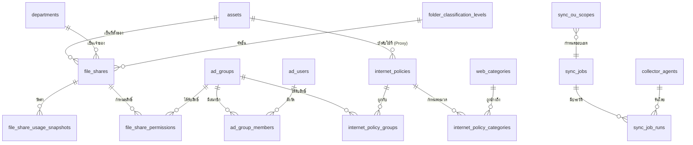

# Permission Control Module — ข้อเสนอการออกแบบ (v1.5)

> **สถานะ:** รอการอนุมัติ — ยังไม่เขียน SQL
> **ขอบเขต:** สิทธิ์การเข้าถึง File Server Folder และสิทธิ์ Internet โดยอ้างอิง AD Group
> **เอกสารก่อนหน้า:** `08-taxonomy-proposal.md` · `09-master-asset-contract-history.md`

---

## 1. สรุปการตัดสินใจที่ได้รับ

| # | ประเด็น | คำตอบ | ผลต่อการออกแบบ |
|:--:|---|---|---|
| 1 | ระบบ File Server | Windows Server + **FSRM** | ต้องมี Collector Agent ในวง Domain |
| 2 | สิทธิ์ AD Group ต่อ Folder | **กรอกมือ** | ไม่สแกน NTFS ACL — ตัดงานส่วนที่ยากที่สุดออก |
| 3 | Proxy Server | **กรอกมือ ไม่ต่อ API** | ไม่ต้องถือ Token ของ Firewall |
| 4 | ขอบเขตการเขียน | **Read-Only เท่านั้น** | ไม่แก้ AD / NTFS — ไม่ต้องมี Approval Workflow |
| 5 | Quota / Usage | **ดึงอัตโนมัติจาก FSRM** | Collector เรียก `Get-FsrmQuota` ผ่าน WinRM |
| 6 | ระดับชั้นความลับ | **ช่องเดียว 7 ค่า + ลำดับ 1–7** | Lookup Table พร้อม `rank` |
| 7 | ข้อมูล AD | ดึงผ่าน **Collector ตัวเดียวกัน** | เปิด Firewall จุดเดียว |
| 8 | ขอบเขต AD | **เฉพาะ OU ที่กำหนด** | มีตารางระบุ OU ที่จะ Sync |
| 9 | การมองเห็น | **จำกัดตามชั้นความลับ** | บทบาทต่ำเห็นเฉพาะชั้นล่าง |

### ⚠️ จุดที่คำตอบขัดกันเอง — ขอเสนอทางออก

ในข้อ "นโยบาย Internet ต้องเก็บอะไรบ้าง" คุณเลือกทั้ง **หมวดเว็บ** + **ผูก Proxy Asset** และ **"ไม่ต้อง แค่ชื่อ + Group พอ"** พร้อมกัน ซึ่งขัดกันเอง

**ทางออกที่เสนอ** — ออกแบบให้ทั้งสองอย่างเป็น **ช่องเสริม (Optional)**

- นโยบายที่กรอกแค่ *ชื่อ + AD Group* → บันทึกได้ ใช้งานได้ทันที
- นโยบายที่อยากลงรายละเอียด → เพิ่มหมวดเว็บและระบุ Proxy ทีหลังได้
- ไม่มีการบังคับกรอก ไม่ต้องแก้โครงสร้างภายหลัง

---

## 2. ขอบเขต — อะไรอยู่ใน อะไรไม่อยู่

### ✅ อยู่ในขอบเขต

- ทะเบียน Folder บน File Server พร้อมชั้นความลับและแผนกเจ้าของ
- บันทึก AD Group ที่มีสิทธิ์ Read-Write และ Read-Only (เลือกจากรายการ AD จริง)
- ทะเบียนนโยบาย Internet ผูกกับ AD Group
- Sync ผู้ใช้และกลุ่มจาก AD ตาม OU ที่กำหนด รวม **กลุ่มซ้อนกลุ่ม**
- ตอบคำถาม "ผู้ใช้คนนี้เข้าอะไรได้บ้าง" และ "โฟลเดอร์นี้ใครเข้าได้บ้าง"
- Quota / Usage อัตโนมัติจาก FSRM พร้อมกราฟแนวโน้ม
- Dashboard และการตรวจจับความผิดปกติ
- ตั้งเวลา Sync และดูประวัติการ Sync

### ❌ ไม่อยู่ในขอบเขต

| ไม่ทำ | เหตุผล |
|---|---|
| สแกน NTFS ACL ของจริง | สิทธิ์กรอกมือตามที่ตกลง |
| แก้ไขสิทธิ์กลับไปที่ AD หรือ File Server | Read-Only ตามที่ตกลง |
| ต่อ API กับ Proxy / Firewall | กรอกมือตามที่ตกลง |
| นับจำนวน Lease ของ DHCP หรือ Session ของ Proxy | ไม่มีการเชื่อมต่อ |
| Approval Workflow | เคยตัดออกไปแล้วตั้งแต่ต้นโปรเจกต์ |

---

## 3. สถาปัตยกรรมภาพรวม

```
          วง Domain (ภายใน)                          โซนแอปพลิเคชัน
 ┌──────────────────────────────────┐        ┌────────────────────────────┐
 │                                  │        │                            │
 │   Active Directory (DC)          │        │   IT Inventory Web App     │
 │      ▲                           │        │                            │
 │      │ LDAPS 636 (อ่านอย่างเดียว) │        │   ┌────────────────────┐   │
 │      │                           │        │   │ REST API           │   │
 │   ┌──┴──────────────┐            │ HTTPS  │   │ /api/collector/... │   │
 │   │ Collector Agent │────────────┼───────▶│   │  + API Key         │   │
 │   └──┬──────────────┘            │  POST  │   └────────┬───────────┘   │
 │      │                           │        │            ▼               │
 │      │ WinRM 5986                │        │      SQL Server 2025       │
 │      ▼                           │        │                            │
 │   File Server × N                │        └────────────────────────────┘
 │      └ Get-FsrmQuota             │
 │                                  │
 └──────────────────────────────────┘

 Firewall เปิดทางเดียว: Collector ──▶ Web App (443)
 Web App ไม่ต้องเอื้อมเข้าวง Domain เลย
```

### ทำไมต้องมี Collector — ไม่ใช่ทางเลือก แต่เป็นข้อจำกัดจริง

Windows File Server **ไม่มี REST API** สำหรับ Quota/Usage ช่องทางที่มีจริงคือ PowerShell / WMI ซึ่งต้องเรียกจากเครื่องที่อยู่ในวง Domain

| หน้าที่ของ Collector | คำสั่งที่ใช้ | ความถี่ |
|---|---|---|
| ดึงผู้ใช้จาก AD | LDAP query ตาม OU ที่กำหนด | ตามตาราง |
| ดึงกลุ่มและสมาชิก | LDAP query + คลี่กลุ่มซ้อน | ตามตาราง |
| ดึง Quota / Usage | `Get-FsrmQuota` ผ่าน WinRM | ตามตาราง |

### ความปลอดภัยของ Collector

| หัวข้อ | ข้อกำหนด |
|---|---|
| สิทธิ์ Service Account | **อ่านอย่างเดียว** — `Domain Users` + สิทธิ์อ่าน FSRM เท่านั้น ห้ามเป็น Domain Admin |
| การยืนยันตัวตน | API Key เก็บใน DB เป็น **SHA-256 Hash** ไม่เก็บค่าจริง (แบบเดียวกับ Refresh Token เดิม) |
| การเก็บรหัส Domain | เก็บที่ Collector ด้วย **Windows DPAPI** ไม่เก็บใน DB ของเว็บ |
| จำกัดต้นทาง | ระบุ IP ที่อนุญาตต่อ Agent |
| Heartbeat | Agent รายงานตัวทุก 5 นาที — ถ้าเงียบเกิน 15 นาที ขึ้นเตือนบน Dashboard |

---

## 4. โครงสร้างข้อมูล

### 4.1 ภาพรวมความสัมพันธ์



### 4.2 ตารางใหม่ 13 ตาราง

| # | ตาราง | หน้าที่ | Temporal |
|:--:|---|---|:--:|
| 1 | `folder_classification_levels` | 7 ชั้นความลับ พร้อมลำดับ 1–7 | ✅ |
| 2 | `classification_role_visibility` | บทบาทไหนเห็นชั้นไหนได้ | ✅ |
| 3 | `file_shares` | ทะเบียน Folder (ข้อมูลที่กรอกมือ) | ✅ |
| 4 | `file_share_permissions` | AD Group + ระดับสิทธิ์ ต่อ Folder | ✅ |
| 5 | `file_share_usage_snapshots` | Quota / Usage รายครั้งที่วัด | ❌ |
| 6 | `access_levels` | RW / RO (Lookup) | ✅ |
| 7 | `ad_users` | ผู้ใช้จาก AD | ✅ |
| 8 | `ad_groups` | กลุ่มจาก AD | ✅ |
| 9 | `ad_group_members` | สมาชิกโดยตรง (รองรับกลุ่มซ้อน) | ✅ |
| 10 | `internet_policies` | นโยบาย Internet | ✅ |
| 11 | `internet_policy_groups` | นโยบาย ↔ AD Group | ✅ |
| 12 | `web_categories` + `internet_policy_categories` | หมวดเว็บ (ช่องเสริม) | ✅ |
| 13 | `collector_agents` · `sync_jobs` · `sync_ou_scopes` · `sync_job_runs` | งาน Sync และประวัติ | บางส่วน |

### 4.3 `folder_classification_levels` — ข้อมูลตั้งต้น

| rank | code | ชื่อไทย | ชื่ออังกฤษ | สี |
|:--:|---|---|---|---|
| 1 | `TOP_SECRET` | ลับที่สุด | Top Secret | แดงเข้ม |
| 2 | `SECRET` | ลับมาก | Secret | แดง |
| 3 | `CONFIDENTIAL` | ลับ | Confidential | ส้ม |
| 4 | `SECTION` | ระดับฝ่าย | Section | เหลือง |
| 5 | `SHARE` | ใช้ร่วมกัน | Share | น้ำเงิน |
| 6 | `CENTER` | ส่วนกลาง | Center | เขียว |
| 7 | `SPECIAL` | เฉพาะกิจ | Special | ม่วง |

> **หมายเหตุ** — `SPECIAL` ถูกวางไว้ลำดับ 7 ตามที่ระบุมา แต่ในทางปฏิบัติโฟลเดอร์ "เฉพาะกิจ" อาจมีความลับสูงกว่า "ใช้ร่วมกัน" ได้
>
> เนื่องจากออกแบบเป็น **Lookup Table ไม่ใช่ CHECK Constraint** การสลับลำดับภายหลังทำได้ด้วยการ `UPDATE` แถวเดียว **ไม่ต้องแก้โครงสร้างฐานข้อมูล** — เป็นเหตุผลเดียวกับที่ทั้งระบบเลี่ยง ENUM มาตั้งแต่ต้น

### 4.4 `file_shares` — ช่องข้อมูลหลัก

| ช่อง | ชนิด | บังคับ | หมายเหตุ |
|---|---|:--:|---|
| `asset_id` | INT FK | ✅ | ต้องเป็น Server ที่มีบทบาท `FILE` เท่านั้น — บังคับด้วย Trigger |
| `share_name` | NVARCHAR(128) | ✅ | ชื่อ Share ที่ผู้ใช้เห็น |
| `folder_path` | NVARCHAR(500) | ✅ | UNC Path เต็ม เช่น `\\FS01\Finance\Budget` |
| `classification_id` | INT FK | ✅ | 1 ใน 7 ชั้น |
| `owner_department_id` | INT FK | ✅ | **บังคับ** — โฟลเดอร์ต้องมีเจ้าของเสมอ |
| `owner_user_id` | INT FK | ⬜ | ผู้รับผิดชอบรายบุคคล (ถ้ามี) |
| `fsrm_quota_template` | NVARCHAR(128) | ⬜ | ชื่อ Template ของ FSRM |
| `business_purpose` | NVARCHAR(500) | ⬜ | ใช้ทำอะไร — จำเป็นตอนทบทวนสิทธิ์ |
| `last_reviewed_at` / `last_reviewed_by` | — | ⬜ | ทบทวนสิทธิ์ครั้งล่าสุดเมื่อไร โดยใคร |

**ดัชนีไม่ซ้ำ** — `(asset_id, folder_path) WHERE is_deleted = 0`

> ช่อง `last_reviewed_at` เป็นข้อเสนอเพิ่ม — ผู้ตรวจสอบมักถามว่า "ทบทวนสิทธิ์ครั้งสุดท้ายเมื่อไร" ถ้าไม่เก็บไว้จะตอบไม่ได้ และมีต้นทุนแค่ 2 ช่อง

### 4.5 `file_share_permissions` — หัวใจของโมดูล

| ช่อง | ชนิด | หมายเหตุ |
|---|---|---|
| `share_id` | INT FK | โฟลเดอร์ |
| `ad_group_id` | INT FK **NULL ได้** | ชี้ไปยัง AD Group ที่ Sync มาจริง |
| `ad_group_name_raw` | NVARCHAR(256) | ชื่อที่บันทึกไว้ ณ ตอนกรอก |
| `access_level_id` | INT FK | `READ_WRITE` หรือ `READ_ONLY` |
| `granted_reason` | NVARCHAR(500) | เหตุผลที่ให้สิทธิ์ |

**ทำไมต้องเก็บทั้ง FK และชื่อดิบ**

| สถานการณ์ | ผลลัพธ์ |
|---|---|
| Group ปกติ | `ad_group_id` มีค่า → เทียบกับผู้ใช้ได้ |
| Group ถูกลบจาก AD | `ad_group_id` ว่าง แต่ยังรู้ว่าเคยผูกกับกลุ่มชื่ออะไร → **ขึ้นเตือน** |
| Group ถูกเปลี่ยนชื่อ | FK ยังอยู่ (ผูกด้วย GUID) → ระบบตามทัน ไม่หลุด |

---

## 5. ประเด็นออกแบบสำคัญ 6 ข้อ

### 🔑 5.1 ผูกด้วย `objectGUID` ไม่ใช่ชื่อกลุ่ม

AD มีตัวระบุถาวรชื่อ `objectGUID` ที่**ไม่เปลี่ยนแม้จะเปลี่ยนชื่อกลุ่มหรือย้าย OU**

ถ้าผูกด้วยชื่อ — วันที่ฝ่าย Infra เปลี่ยน `FS-Finance-RW` เป็น `GRP-FIN-RW` ระบบจะรายงานทันทีว่า "ไม่มีใครเข้าโฟลเดอร์การเงินได้" ซึ่งผิดและสร้างความตื่นตระหนกโดยไม่จำเป็น

**ข้อกำหนด** — `ad_groups.object_guid` และ `ad_users.object_guid` เป็น Unique Key ที่ใช้จับคู่ตอน Sync ทุกครั้ง

### 🔑 5.2 ห้ามลบข้อมูล AD ที่หายไป — ให้ทำเครื่องหมายแทน

เมื่อผู้ใช้หรือกลุ่มหายจาก AD **ห้าม `DELETE`** ให้ตั้ง `is_present_in_ad = 0` และ `disappeared_at` แทน

เพราะถ้าลบทิ้ง ประวัติสิทธิ์ย้อนหลังจะชี้ไปยังแถวที่ไม่มีอยู่ → คำถาม *"ตอนไฟล์รั่วเมื่อ 6 เดือนก่อน ใครเข้าถึงได้บ้าง"* จะตอบไม่ได้ ซึ่งขัดกับเหตุผลทั้งหมดที่เลือกใช้ Temporal Tables

### 🔴 5.3 Temporal Tables กับงาน Sync — กับดักที่ต้องระวังที่สุด

**SQL Server เขียนประวัติทุกครั้งที่มีคำสั่ง `UPDATE` โดนแถวนั้น แม้ค่าใหม่จะเท่าเดิมทุกช่อง**

ถ้า Sync แบบตรงไปตรงมา

```
ผู้ใช้ 5,000 คน × Sync วันละครั้ง × 365 วัน = ประวัติ 1,825,000 แถวต่อปี
ทั้งที่ความจริงอาจมีคนเปลี่ยนแปลงแค่ปีละไม่กี่ร้อยคน
```

ผลคือตารางประวัติบวมจนค้นหาช้า และประวัติที่มีค่าจริงจะจมอยู่ในข้อมูลขยะ

**ทางแก้ที่บังคับใช้** — ต้อง `UPDATE` เฉพาะแถวที่ค่าต่างจริงเท่านั้น

```sql
MERGE dbo.ad_users AS tgt
USING @incoming AS src ON tgt.object_guid = src.object_guid
WHEN MATCHED AND EXISTS (
        SELECT src.display_name, src.email, src.is_enabled, src.department_name_raw
        EXCEPT
        SELECT tgt.display_name, tgt.email, tgt.is_enabled, tgt.department_name_raw )
    THEN UPDATE SET ...
```

`EXCEPT` จัดการค่า `NULL` ได้ถูกต้อง ต่างจากการเทียบด้วย `<>` ที่จะพลาดเมื่อเจอ `NULL`

> SQL Server 2022 ขึ้นไปใช้ `IS DISTINCT FROM` แทนได้ อ่านง่ายกว่า — เป้าหมายเราคือ SQL Server 2025 จึงใช้ได้

**ช่อง `last_synced_at` ต้องแยกออกไปอยู่ตารางอื่นหรือไม่เปิด Temporal** ไม่งั้นค่านี้ค่าเดียวจะทำให้ทุกแถวถูกนับว่า "เปลี่ยนแปลง" ทุกรอบ

### 🔑 5.4 Quota / Usage ต้องแยกออกจากตารางหลัก

ด้วยเหตุผลเดียวกับข้อ 5.3 — ถ้าเก็บ `usage_bytes` ไว้ใน `file_shares` ที่เปิด Temporal ประวัติของโฟลเดอร์จะกลายเป็นบันทึกการใช้พื้นที่รายวัน ปนกับประวัติการเปลี่ยนสิทธิ์ซึ่งเป็นสิ่งที่เราอยากดูจริงๆ

**แยกเป็น `file_share_usage_snapshots`** — ไม่เปิด Temporal เพิ่มแถวอย่างเดียว

| ประโยชน์ | รายละเอียด |
|---|---|
| ประวัติสิทธิ์สะอาด | `file_shares` เปลี่ยนเฉพาะตอนคนแก้ข้อมูลจริง |
| ได้กราฟแนวโน้มฟรี | มีข้อมูลรายวันอยู่แล้ว พล็อตได้ทันที |
| พยากรณ์ได้ | "ที่อัตรานี้ โฟลเดอร์จะเต็มใน 45 วัน" |
| จัดการขนาดได้ | เก็บรายวัน 90 วัน แล้วยุบเป็นรายเดือน |

ค่าปัจจุบันดึงด้วย `OUTER APPLY ... TOP 1 ORDER BY measured_at DESC` ซึ่งเป็นรูปแบบเดียวกับที่ใช้ในระบบเดิมอยู่แล้ว

### 🔑 5.5 กลุ่มซ้อนกลุ่ม — ต้องคลี่ และต้องกันวงวน

```
somchai ──▶ IT-Staff ──▶ IT-All ──▶ FS-Share-RO ──▶ เข้าโฟลเดอร์ Share ได้
```

ถ้าอ่านแค่ `memberOf` ชั้นเดียว จะตอบว่า somchai **เข้าโฟลเดอร์นั้นไม่ได้** ซึ่งผิด

**3 เรื่องที่ต้องทำ**

| เรื่อง | วิธี |
|---|---|
| คลี่กลุ่มทุกชั้น | LDAP Matching Rule `1.2.840.113556.1.4.1941` ฝั่ง Collector และ Recursive CTE ฝั่ง SQL |
| `Domain Users` ไม่โผล่ | กลุ่มหลักของผู้ใช้อยู่ที่ `primaryGroupID` ต้องอ่านแยกและเติมเข้าไปเอง |
| **กันวงวน** | AD ข้ามโดเมนอาจเกิด A→B→A ได้ ต้องใส่ `OPTION (MAXRECURSION 32)` และเก็บเส้นทางไว้ตรวจซ้ำ ไม่งั้น Query ค้าง |

### 🔑 5.6 ความสดของข้อมูลต้องมองเห็นเสมอ

ข้อมูลทั้งหมดมาจากการ Sync เป็นรอบ **ไม่ใช่ข้อมูลสด**

ถ้า Sync ล้มเหลวเมื่อ 3 วันก่อนแล้วไม่มีใครรู้ หน้าจอจะโชว์ข้อมูลเก่าเหมือนข้อมูลใหม่ — แล้วมีคนตัดสินใจเรื่องสิทธิ์จากข้อมูลนั้น

**ข้อกำหนด**

- ทุกหน้าที่แสดงข้อมูลจาก AD หรือ FSRM ต้องมีป้าย **"ข้อมูล ณ [วันเวลา]"**
- ถ้าเกินรอบที่กำหนด 2 เท่า → ป้ายเปลี่ยนเป็นสีเตือน
- ถ้า Sync ล้มเหลวติดกัน 2 ครั้ง → แจ้งเตือนผู้ดูแลระบบ

---

## 6. การตรวจจับความผิดปกติ

ทำได้ทั้งหมดโดย**ไม่ต้องแตะ File Server** เพราะใช้แค่ข้อมูล AD เทียบกับข้อมูลที่กรอกไว้

| # | สิ่งที่ตรวจเจอ | ความเสี่ยง | ระดับ |
|:--:|---|---|:--:|
| 1 | AD Group ที่ผูกไว้ **หายจาก AD แล้ว** | สิทธิ์ที่บันทึกไว้ไม่มีผลจริง ข้อมูลลวง | 🔴 |
| 2 | Group **ไม่มีสมาชิก** แต่ผูกโฟลเดอร์ชั้น 1–3 | กลุ่มร้าง รอคนเผลอใส่สมาชิก | 🔴 |
| 3 | ผู้ใช้ **Disabled** แต่ยังอยู่ในกลุ่มที่มีสิทธิ์ | บัญชีคนลาออกยังมีสิทธิ์ค้าง | 🔴 |
| 4 | โฟลเดอร์ชั้น 1–3 ให้สิทธิ์ **Read-Write แก่กลุ่มใหญ่** (เกิน N คน) | ขอบเขตกว้างเกินชั้นความลับ | 🟠 |
| 5 | โฟลเดอร์ **ไม่เคยทบทวนสิทธิ์เกิน 12 เดือน** | ไม่มีใครดูแล | 🟠 |
| 6 | ผู้ใช้อยู่ในกลุ่มที่ให้สิทธิ์โฟลเดอร์เดียวกันทั้ง RW และ RO | สิทธิ์ซ้ำซ้อน ตั้งใจหรือพลาด | 🟡 |
| 7 | โฟลเดอร์ใช้พื้นที่เกิน 90% ของ Quota | ใกล้เต็ม | 🟡 |
| 8 | ผู้ใช้ไม่ได้เข้าระบบเกิน 90 วัน แต่ยังมีสิทธิ์ชั้น 1–2 | บัญชีค้าง | 🟠 |

ข้อ 7 ใช้กลไก `notification_history` เดิมได้เลย — **ไม่ต้องเขียนระบบแจ้งเตือนใหม่**

---

## 7. มุมมองข้อมูล (Views)

| View | ตอบคำถาม |
|---|---|
| `vw_ad_group_expanded` | Recursive CTE คลี่กลุ่มซ้อนทุกชั้น — เป็นฐานของ View อื่น |
| `vw_user_effective_access` | **"คนนี้เข้าโฟลเดอร์อะไรได้บ้าง ระดับไหน ผ่านกลุ่มไหน"** |
| `vw_share_effective_users` | **"โฟลเดอร์นี้ใครเข้าได้บ้าง"** — คลี่ถึงตัวคน |
| `vw_user_internet_policy` | "คนนี้มีสิทธิ์ Internet นโยบายอะไร" |
| `vw_file_share_current_usage` | Quota / Usage ล่าสุดพร้อม % และวันที่วัด |
| `vw_file_share_list` | รายการหลักสำหรับหน้า List |
| `vw_permission_issues` | รวมความผิดปกติทั้ง 8 ข้อไว้ที่เดียว |
| `vw_department_folder_summary` | สรุปรายแผนก |
| `vw_classification_summary` | สรุปรายชั้นความลับ |
| `vw_sync_health` | สถานะงาน Sync ล่าสุดและความสด |

**จุดสำคัญของ `vw_user_effective_access`** — ต้องแสดง**เส้นทาง**ที่ได้สิทธิ์มาด้วย ไม่ใช่แค่ผลลัพธ์

> `somchai` → `IT-Staff` → `IT-All` → `FS-Share-RO` → อ่าน `\\FS01\Share`

ถ้าบอกแค่ "เข้าได้" คนที่ต้องไปถอนสิทธิ์จะไม่รู้ว่าต้องไปถอนที่กลุ่มไหน

---

## 8. Dashboard

| ส่วน | เนื้อหา |
|---|---|
| แถวตัวเลขสรุป | จำนวน File Server · จำนวน Folder · พื้นที่รวมที่ใช้ · จำนวนความผิดปกติ |
| กราฟแท่ง | จำนวน Folder แยกตามแผนก |
| กราฟวงกลม | จำนวน Folder แยกตามชั้นความลับ (ใช้สีตาม Lookup) |
| ตารางอันดับ | Folder ที่ใช้พื้นที่สูงสุด 10 อันดับ พร้อม % ของ Quota |
| กราฟเส้น | แนวโน้มการใช้พื้นที่รวมย้อนหลัง 90 วัน |
| รายการเตือน | ความผิดปกติเรียงตามระดับ |
| แถบสถานะ Sync | Sync ล่าสุดเมื่อไร สำเร็จหรือไม่ Collector ยังมีชีวิตไหม |

**การมองเห็นถูกจำกัดตามชั้นความลับ** — ตัวเลขบน Dashboard ของแต่ละคนจะนับเฉพาะโฟลเดอร์ที่ตนมีสิทธิ์เห็น เพื่อไม่ให้การนับกลายเป็นการเปิดเผยว่ามีโฟลเดอร์ลับอยู่กี่รายการ

---

## 9. ความปลอดภัยของโมดูลนี้เอง

หน้าจอที่บอกว่า *"AD Group ไหนเข้าโฟลเดอร์ชั้นลับที่สุดได้"* คือ**แผนที่สำหรับผู้บุกรุก** โมดูลนี้จึงต้องเข้มกว่าส่วนอื่นของระบบ

| มาตรการ | รายละเอียด |
|---|---|
| สิทธิ์แยกเฉพาะ | ไม่ผูกกับสิทธิ์ดู Asset ทั่วไป — คนดูแล Printer ไม่ควรเห็นสิทธิ์โฟลเดอร์การเงิน |
| จำกัดตามชั้นความลับ | ตาราง `classification_role_visibility` กำหนดว่าบทบาทไหนเห็นชั้นไหน |
| **บันทึกการเปิดดู** | ระบบเดิมบันทึก Audit เฉพาะตอน **แก้ไข** — โมดูลนี้ต้องบันทึกตอน **เปิดดู** ชั้น 1–3 ด้วย |
| ปิดการส่งออก | Export รายการสิทธิ์ชั้น 1–2 ต้องมีสิทธิ์แยกอีกชั้น |
| ปกปิดในรายการรวม | ผู้ที่ไม่มีสิทธิ์เห็นชั้นนั้น จะไม่เห็นแม้แต่ชื่อโฟลเดอร์ |

> ข้อ "บันทึกการเปิดดู" เป็นส่วนขยายจากระบบ Audit เดิม — ต้องเพิ่มประเภทเหตุการณ์ `VIEW_SENSITIVE` เข้าไปใน `audit_logs` ซึ่งเป็นตาราง Append-Only อยู่แล้ว ไม่ต้องแก้โครงสร้าง

---

## 10. สิ่งที่ระบบนี้ตอบไม่ได้ — ต้องระบุให้ชัดบนหน้าจอ

| ข้อจำกัด | เหตุผล | สิ่งที่ต้องทำ |
|---|---|---|
| **ไม่รู้สิทธิ์จริงบน NTFS** | ไม่ได้สแกน ACL | หน้าจอต้องเขียนว่า "สิทธิ์ตามที่บันทึกไว้" ไม่ใช่ "สิทธิ์จริงบนเครื่อง" |
| ถ้ามีคนไปแก้ ACL ที่เครื่องตรง ระบบไม่รู้ | เหตุผลเดียวกัน | ต้องมีระเบียบว่าการแก้สิทธิ์ต้องบันทึกในระบบด้วย |
| **ไม่รู้ว่านโยบาย Internet ตรงกับ Proxy จริงไหม** | ไม่ต่อ API | หน้าจอเขียนว่า "ตามที่บันทึกไว้" เช่นกัน |
| Quota เป็นค่า ณ เวลา Sync | ไม่ใช่ Real-time | แสดงวันเวลาที่วัดทุกครั้ง |
| Folder ที่ไม่ได้ตั้ง FSRM Quota จะไม่มี Usage | FSRM ให้ข้อมูลเฉพาะที่ตั้ง Quota ไว้ | แสดงเป็น "ยังไม่ได้ตั้ง Quota" ไม่ใช่ "0 ไบต์" |

**หลักการ** — ระบบต้องบอกความจริงว่าตัวเองรู้อะไรและไม่รู้อะไร การแสดงข้อมูลที่ไม่มีเป็นเลข 0 จะทำให้คนเข้าใจผิดและตัดสินใจผิด ซึ่งเป็นหลักการเดียวกับที่ใช้ตอนออกแบบโมดูล VLAN (เรื่อง DHCP Pool)

---

## 11. ผลกระทบต่อระบบเดิม

| ระบบเดิม | ผลกระทบ |
|---|---|
| `assets` · `departments` · `server_roles` | **ไม่แก้** — ใช้ต่อได้ทันที |
| `users` | เพิ่มช่อง `ad_object_guid` เพื่อเชื่อมผู้ใช้ระบบกับบัญชี AD (ไม่บังคับ) |
| `audit_logs` | เพิ่มประเภทเหตุการณ์ `VIEW_SENSITIVE` — ไม่แก้โครงสร้าง |
| `notification_history` | เพิ่มประเภทการแจ้งเตือน Quota — ใช้กลไกเดิมทั้งหมด |
| RBAC | **เพิ่มสิทธิ์ใหม่** สำหรับโมดูลนี้ และตารางการมองเห็นตามชั้นความลับ |

**ไม่มีการลบหรือเปลี่ยนโครงสร้างตารางเดิม** — เป็นการเพิ่มล้วน ความเสี่ยงต่อของที่ทำไว้แล้วต่ำมาก

---

## 12. ประมาณการงาน

| ส่วน | ขนาด |
|---|---|
| SQL — ตาราง 13 + View 10 + Trigger 3 + ข้อมูลตั้งต้น | ~900 บรรทัด |
| Collector Agent (PowerShell / .NET) | โครงการย่อยแยกต่างหาก |
| หน้าเว็บ — Folder List · Folder Form · Dashboard · ค้นหาสิทธิ์รายคน · นโยบาย Internet · ตั้งค่า Sync | 6 หน้าจอ |
| API — CRUD + รับข้อมูลจาก Collector + คำนวณสิทธิ์ | ~12 endpoint |

**การตัดสแกน NTFS ACL และ Proxy API ออก ลดงานลงประมาณ 2 Sprint และตัดความเสี่ยงทางเทคนิคที่สูงที่สุดออกไปทั้งหมด**

---

## 13. สิ่งที่ยังต้องยืนยันก่อนเขียน SQL

| # | เรื่อง | ทำไมต้องรู้ |
|:--:|---|---|
| 1 | **ชื่อ OU ที่จะ Sync** | ใส่เป็นข้อมูลตั้งต้นได้เลย — ถ้ายังไม่ทราบ จะทำเป็นหน้าให้ Admin กรอกเองภายหลัง |
| 2 | **บทบาทไหนเห็นชั้นไหน** | ต้องรู้ชื่อบทบาทจริงทั้ง 4 เพื่อใส่ข้อมูลตั้งต้นในตารางการมองเห็น |
| 3 | **ความถี่ในการ Sync** | เสนอ — AD วันละครั้งตอนตี 2, FSRM วันละครั้งตอนตี 3 |
| 4 | **จำนวนโดยประมาณ** | ผู้ใช้กี่คน กลุ่มกี่กลุ่ม โฟลเดอร์กี่รายการ — ใช้ตัดสินใจว่าต้องทำตารางสรุปล่วงหน้าหรือไม่ |
| 5 | **หมวดเว็บที่ใช้จริง** | ถ้ามีรายการจาก Proxy อยู่แล้ว จะใส่เป็นข้อมูลตั้งต้นให้ |

> ข้อ 1–5 ไม่ปิดกั้นการเขียน SQL — ออกแบบให้กรอกทีหลังได้ทั้งหมด แต่ถ้าทราบตอนนี้จะใส่ข้อมูลตั้งต้นให้เลย ไม่ต้องมากรอกเองภายหลัง

---

## 14. สรุปเพื่อขออนุมัติ

โมดูลนี้ทำงานบนหลักการ **"บันทึกสิ่งที่ประกาศไว้ แล้วใช้ข้อมูลจริงจาก AD มาตรวจสอบว่ายังใช้ได้อยู่"**

- สิทธิ์ต่อโฟลเดอร์และนโยบาย Internet → **กรอกมือ**
- ผู้ใช้และกลุ่ม → **ดึงจาก AD จริง**
- Quota และ Usage → **ดึงจาก FSRM จริง**
- ระบบ **ไม่แก้ไขอะไรกลับไปที่ AD หรือ File Server เลย**

สิ่งที่ได้คือความสามารถในการตอบคำถามที่ตอบไม่ได้มาก่อน — *"คนนี้เข้าอะไรได้บ้าง"*, *"โฟลเดอร์นี้ใครเข้าได้"*, *"กลุ่มไหนที่ผูกไว้แล้วหายไปจาก AD"* และ *"ณ วันที่เกิดเหตุ ใครมีสิทธิ์อยู่"*

**หากเห็นชอบตามนี้ จะเริ่มเขียนไฟล์ `14-module-v1.5-permission-control.sql` เป็นลำดับที่ 7 ต่อจาก `12-`**
