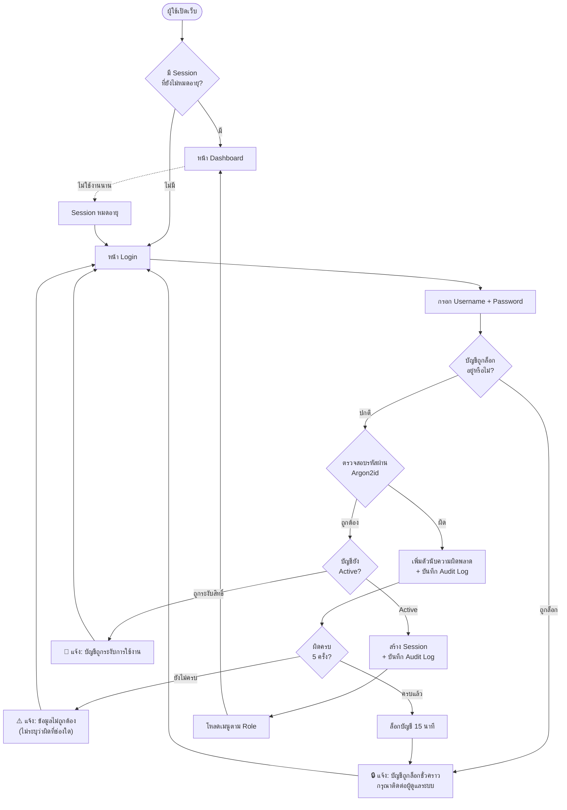
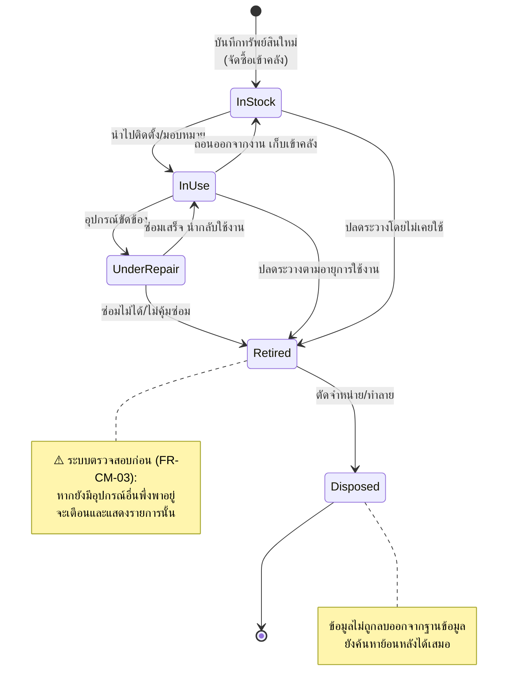
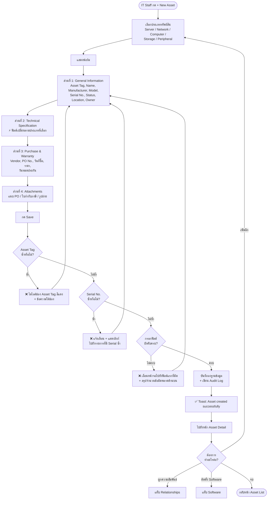
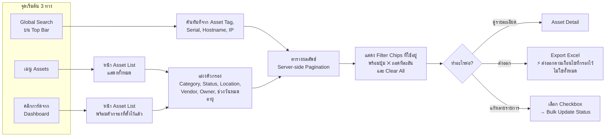
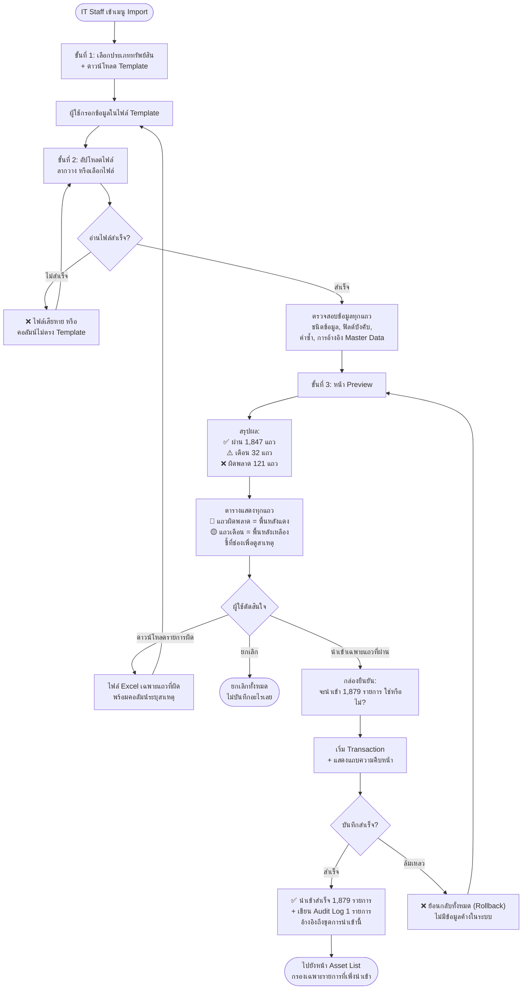
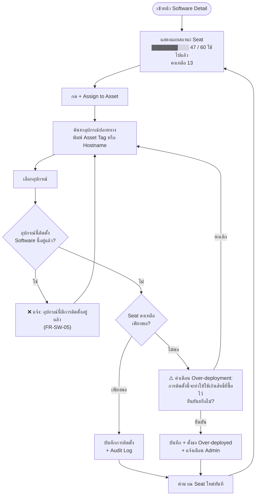
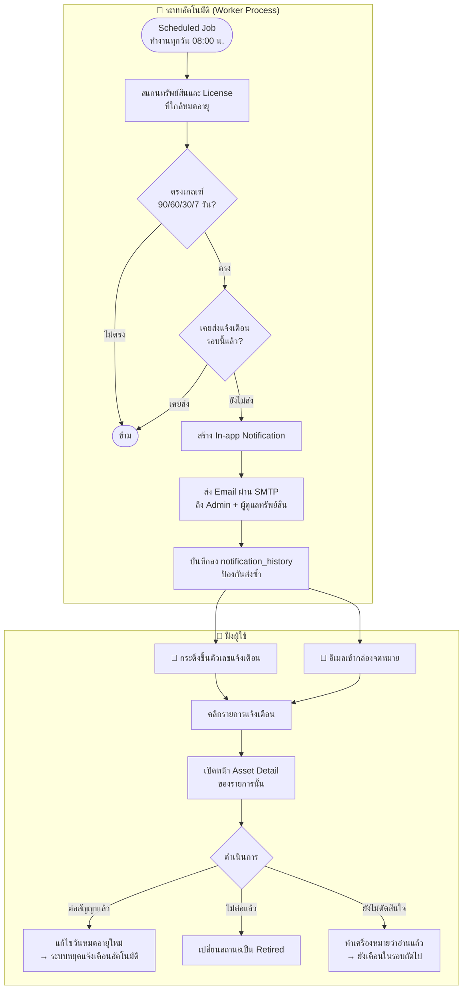
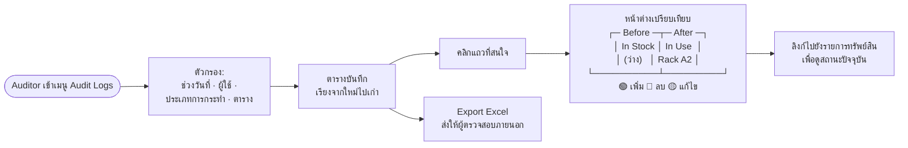

# Phase 2.1 — User Flow & Information Architecture
## KKND — IT Inventory Management System

| หัวข้อ | รายละเอียด |
|---|---|
| **เอกสาร** | User Flow & Information Architecture |
| **เวอร์ชัน** | 1.0 (Draft — รออนุมัติ) |
| **อ้างอิง** | `docs/PRD.md` v1.0 |
| **วันที่** | 2026-09-16 |

---

## 1. Information Architecture (โครงสร้างการนำทาง)

### 1.1 หลักการออกแบบการนำทาง

ระบบใช้ **Persistent Sidebar Navigation** (แถบเมนูด้านซ้ายที่อยู่ถาวร) ด้วยเหตุผล 3 ประการ:

1. ระบบมีเมนูหลัก 8 กลุ่ม ซึ่งเกินขีดจำกัดที่ Top Navigation จะรองรับได้อย่างสบายตา
2. ผู้ใช้หลักคือทีม IT ที่ใช้งานบน Desktop เป็นเวลานาน การมีเมนูอยู่ถาวรช่วยลดจำนวนคลิก
3. รองรับการยุบเป็นไอคอน (Collapsed Mode) เมื่อต้องการพื้นที่แสดงตารางกว้างขึ้น

### 1.2 โครงสร้างเมนูตามสิทธิ์ (Role-Based Navigation)

เมนูที่ผู้ใช้ไม่มีสิทธิ์เข้าถึงจะ **ไม่ถูกแสดง** (ไม่ใช่แสดงแล้วกดไม่ได้) เพื่อลดความสับสน
แต่ฝั่ง Server ยังคงตรวจสอบสิทธิ์ทุก Endpoint เสมอ ตาม NFR-06

| เมนู | ไอคอน | 🔴 Admin | 🟠 IT Staff | 🔵 Auditor | 🟢 Viewer |
|---|:---:|:---:|:---:|:---:|:---:|
| Dashboard | ▦ | ✅ | ✅ | ✅ | ✅ |
| Assets | 🖥 | ✅ | ✅ | ✅ | ✅ |
| Software | 💿 | ✅ | ✅ | ✅ | ✅ |
| Reports | 📊 | ✅ | ✅ | ✅ | ❌ |
| Import | ⬆ | ✅ | ✅ | ❌ | ❌ |
| Audit Logs | 🔍 | ✅ | ⚠️ เฉพาะของตนเอง | ✅ | ❌ |
| Administration | ⚙ | ✅ | ❌ | ❌ | ❌ |
| — Users | | ✅ | ❌ | ❌ | ❌ |
| — Master Data | | ✅ | ❌ | ❌ | ❌ |
| — Settings | | ✅ | ❌ | ❌ | ❌ |

### 1.3 องค์ประกอบที่อยู่ทุกหน้า (Global Elements)

```
┌──────────────────────────────────────────────────────────────────┐
│  TOP BAR                                                          │
│  [☰] KKND    [🔍 Global Search........]   [🔔 3] [☀/🌙] [👤 ▾]  │
├──────────┬───────────────────────────────────────────────────────┤
│ SIDEBAR  │  CONTENT AREA                                          │
│          │  ┌─ Breadcrumb ─────────────────────────────────────┐ │
│ ▦ Dash   │  │  Assets  ›  SRV-2026-001                          │ │
│ 🖥 Assets │  └───────────────────────────────────────────────────┘ │
│ 💿 Soft   │  ┌─ Page Header ────────────────────────────────────┐ │
│ 📊 Report │  │  Page Title                    [Primary Action]   │ │
│ ⬆ Import │  └───────────────────────────────────────────────────┘ │
│ 🔍 Audit  │                                                        │
│ ⚙ Admin  │  ┌─ Page Content ───────────────────────────────────┐ │
│          │  │                                                    │ │
│ ────────  │  │                                                    │ │
│ [«]      │  └───────────────────────────────────────────────────┘ │
└──────────┴───────────────────────────────────────────────────────┘
```

| องค์ประกอบ | หน้าที่ |
|---|---|
| **Global Search** | ค้นหาข้ามทุกประเภททรัพย์สินจาก Asset Tag, Serial, Hostname, IP (FR-SE-01) |
| **🔔 Notification Bell** | แสดงจำนวนแจ้งเตือนที่ยังไม่อ่าน คลิกแล้วเห็นรายการ 5 อันดับล่าสุด (FR-NT-04) |
| **☀/🌙 Theme Toggle** | สลับ Light/Dark Mode และจดจำค่าไว้ (NFR-08) |
| **👤 User Menu** | ชื่อผู้ใช้, Role Badge, Profile, Change Password, Logout |
| **Breadcrumb** | แสดงตำแหน่งปัจจุบันและกลับสู่ระดับบนได้ |

---

## 2. User Flow หลัก

### 2.1 Flow: การเข้าสู่ระบบ (Authentication)



> **หลักความปลอดภัย:** ข้อความแจ้งข้อผิดพลาดต้อง**ไม่บอกว่าผิดที่ Username หรือ Password**
> เพื่อป้องกันการคาดเดาว่ามีบัญชีนั้นอยู่จริงหรือไม่ (User Enumeration)

---

### 2.2 Flow: วงจรชีวิตทรัพย์สิน (Asset Lifecycle)



---

### 2.3 Flow: เพิ่มทรัพย์สินใหม่ (Create Asset)



> **หลักการ UX:** ฟอร์มแบ่งเป็น 4 ส่วนในหน้าเดียว (ไม่ใช่ Wizard หลายขั้น) เพราะผู้ใช้หลัก
> คือ IT Staff ที่กรอกข้อมูลซ้ำๆ วันละหลายรายการ การเห็นทุกช่องพร้อมกันช่วยให้กรอกได้เร็วกว่า
> และแก้ไขย้อนกลับได้โดยไม่ต้องกดถอยหลายขั้น

---

### 2.4 Flow: ค้นหาและกรองข้อมูล (Search & Filter)



> **ข้อกำหนดด้านประสิทธิภาพ:** ทุกการกรองและเรียงลำดับทำที่ฝั่ง Server (NFR-01)
> พร้อมหน่วงเวลาการพิมพ์ (Debounce) ประมาณ 300 ms เพื่อไม่ให้ยิง Request ทุกตัวอักษร

---

### 2.5 Flow: นำเข้าข้อมูลจาก Excel (Import)

Flow นี้สำคัญที่สุดในช่วงเริ่มใช้งานระบบ เพราะต้องย้ายข้อมูลเดิม 2,000+ รายการจาก Excel



> **หลักการสำคัญ:** ผู้ใช้ต้องเห็นผลการตรวจสอบ**ก่อน**ตัดสินใจบันทึกเสมอ (FR-IM-03)
> และการบันทึกเป็น Transaction เดียว — ไม่มีสถานะ "บันทึกไปครึ่งหนึ่ง" (FR-IM-04)

---

### 2.6 Flow: จัดสรรสิทธิ์ Software License (Seat Allocation)



> **หมายเหตุเชิงธุรกิจ:** ระบบ**ไม่บล็อก**การติดตั้งเกินสิทธิ์ แต่บันทึกและแจ้งเตือน
> เพราะในทางปฏิบัติ IT อาจจำเป็นต้องติดตั้งก่อนแล้วจึงจัดซื้อ License เพิ่มตามหลัง
> สิ่งที่ระบบต้องทำคือ**ทำให้มองเห็นได้** ไม่ใช่ขัดขวางการทำงาน

---

### 2.7 Flow: แจ้งเตือนวันหมดอายุ (Expiry Notification)



---

### 2.8 Flow: การตรวจสอบย้อนหลัง (Audit Review)



> **ข้อจำกัดโดยการออกแบบ:** หน้านี้**ไม่มีปุ่ม Edit หรือ Delete ใดๆ** ทั้งสิ้น
> ทั้งในหน้าเว็บและใน API — เพื่อรับประกันความน่าเชื่อถือของหลักฐาน (FR-AD-03)

---

## 3. Flow ตามบทบาทผู้ใช้ (Role-Based Journey)

| Role | เส้นทางการใช้งานหลักในแต่ละวัน |
|---|---|
| 🔴 **Admin** | Login → ตรวจ Dashboard → ดูรายการใกล้หมดอายุ → จัดการผู้ใช้ใหม่ → ตรวจ Audit Log |
| 🟠 **IT Staff** | Login → รับแจ้งงาน → ค้นหาอุปกรณ์ → แก้ไขสถานะ/ผู้ถือครอง → แนบเอกสาร → บันทึก |
| 🔵 **Auditor** | Login → เข้า Reports → ดู License Compliance → เข้า Audit Logs → กรองตามช่วงเวลา → Export |
| 🟢 **Viewer** | Login → ค้นหาอุปกรณ์ที่สนใจ → ดูรายละเอียดและวันหมดประกัน |

---

## 4. หลักการจัดการสถานะหน้าจอ (UI State Principles)

ทุกหน้าที่ดึงข้อมูลต้องออกแบบครบ **5 สถานะ** ไม่ใช่เฉพาะสถานะปกติ

| สถานะ | แนวทางออกแบบ |
|---|---|
| **Loading** | ใช้ Skeleton ที่มีรูปร่างใกล้เคียงเนื้อหาจริง ไม่ใช้วงกลมหมุนกลางจอ เพื่อลดความรู้สึกว่าช้า |
| **Empty (ยังไม่มีข้อมูลเลย)** | อธิบายว่าหน้านี้ใช้ทำอะไร + ปุ่มการกระทำหลัก เช่น "No assets yet — Add your first asset or Import from Excel" |
| **No Result (กรองแล้วไม่พบ)** | ต่างจาก Empty — ต้องบอกว่าไม่พบผลลัพธ์ตามเงื่อนไข + ปุ่ม Clear Filters |
| **Error** | อธิบายด้วยภาษาที่ผู้ใช้เข้าใจ + ปุ่มลองใหม่ + รหัสอ้างอิงสำหรับแจ้งผู้ดูแลระบบ |
| **Success** | Toast มุมขวาบน หายเองใน 4 วินาที · การกระทำที่ย้อนกลับไม่ได้ต้องมีกล่องยืนยันก่อน |

### 4.1 กฎการยืนยันก่อนดำเนินการ (Confirmation Rules)

| การกระทำ | รูปแบบการยืนยัน |
|---|---|
| แก้ไขข้อมูลทั่วไป | ไม่ต้องยืนยัน — บันทึกแล้วแสดง Toast |
| ลบทรัพย์สิน (Soft Delete) | กล่องยืนยันธรรมดา ระบุชื่อรายการที่จะลบ |
| เปลี่ยนสถานะเป็น Disposed | กล่องยืนยัน + แสดงรายการอุปกรณ์ที่พึ่งพาอยู่ (ถ้ามี) |
| Bulk Update หลายรายการ | กล่องยืนยัน + ระบุจำนวนรายการที่จะถูกกระทบ |
| ลบผู้ใช้ / Master Data | กล่องยืนยัน + **ต้องพิมพ์ชื่อรายการเพื่อยืนยัน** |
| Import ข้อมูลจำนวนมาก | หน้า Preview เต็มหน้าจอ + กล่องยืนยันขั้นสุดท้าย |

---

## 5. สรุปหน้าจอที่ต้องออกแบบ Wireframe

| # | หน้าจอ | ความสำคัญ | สถานะ |
|---|---|:---:|:---:|
| 1 | Login | 🔴 สูง | รอออกแบบ |
| 2 | Dashboard | 🔴 สูง | รอออกแบบ |
| 3 | Asset List (ตาราง + ตัวกรอง) | 🔴 สูง | รอออกแบบ |
| 4 | Asset Detail (หลายแท็บ) | 🔴 สูง | รอออกแบบ |
| 5 | Asset Form (เพิ่ม/แก้ไข) | 🔴 สูง | รอออกแบบ |
| 6 | Software Detail (Seat Allocation) | 🟡 กลาง | รอออกแบบ |
| 7 | Import Wizard (3 ขั้น) | 🟡 กลาง | รอออกแบบ |
| 8 | Audit Logs | 🟡 กลาง | รอออกแบบ |
| 9 | Admin — Users & Master Data | 🟢 ต่ำ | รอออกแบบ |

---

*เอกสารนี้เป็นผลลัพธ์ของ Phase 2.1 — ขั้นถัดไปคือ Phase 2.2 Wireframe และ Phase 2.3 Design System*
